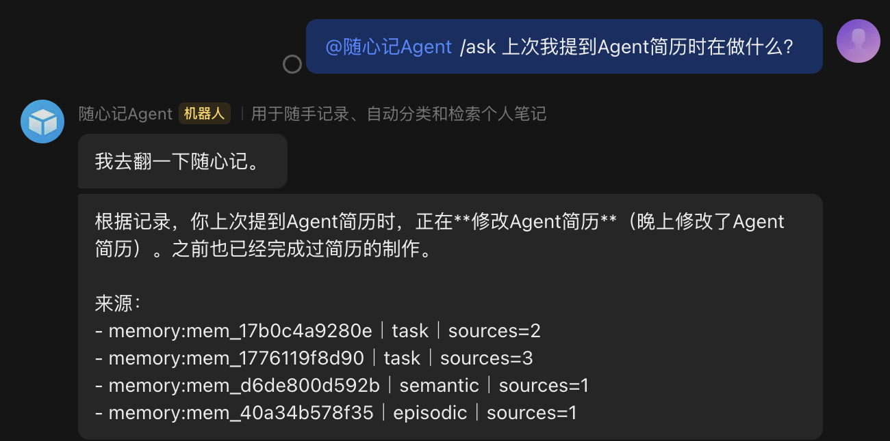
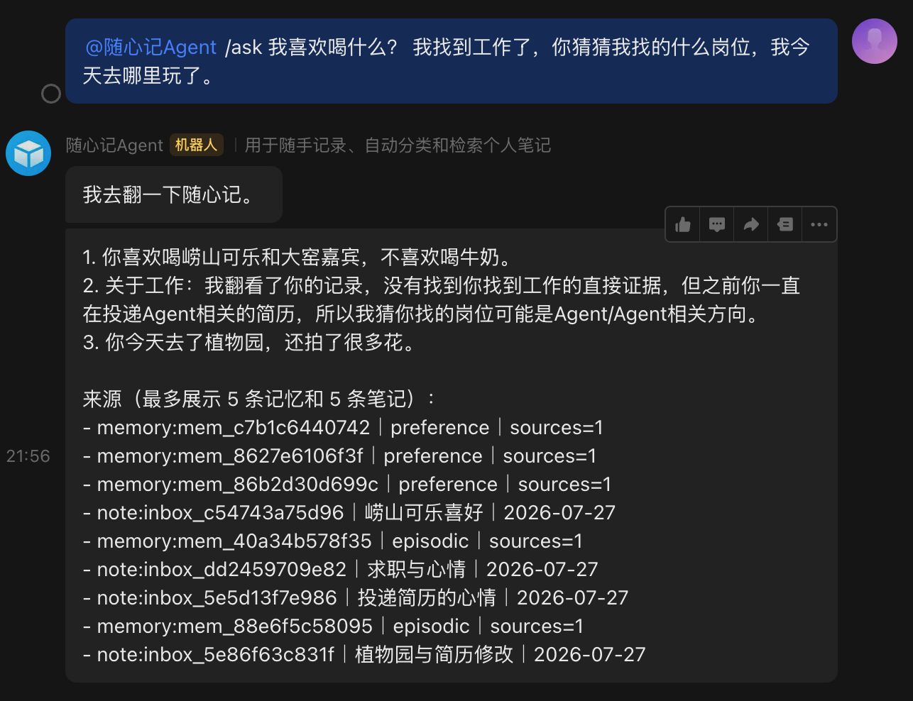
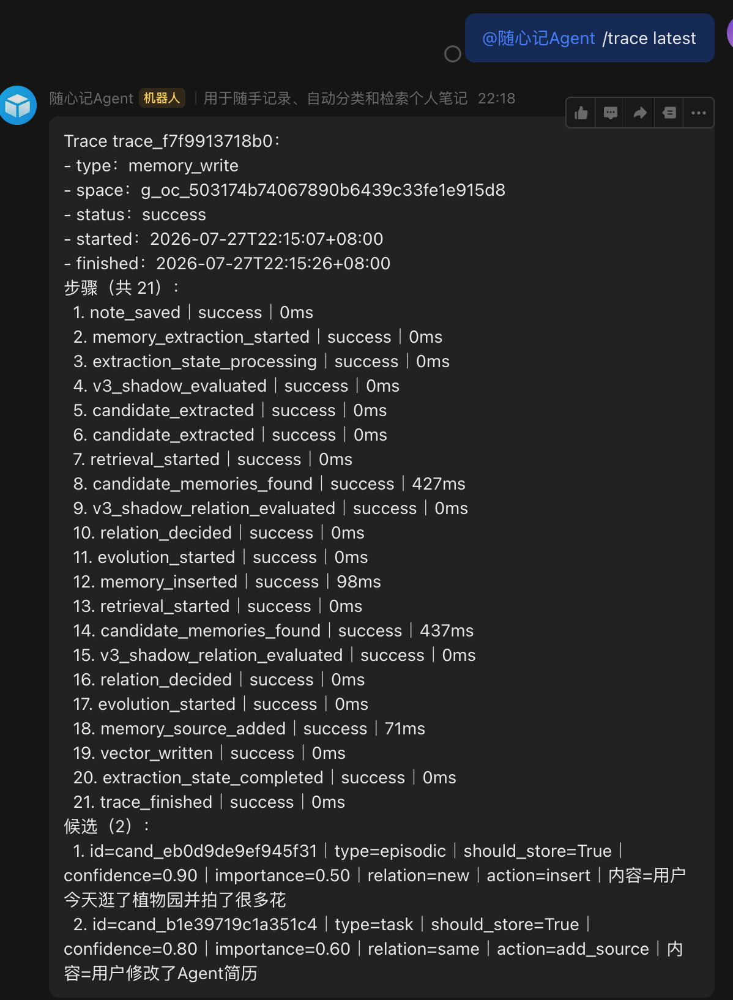
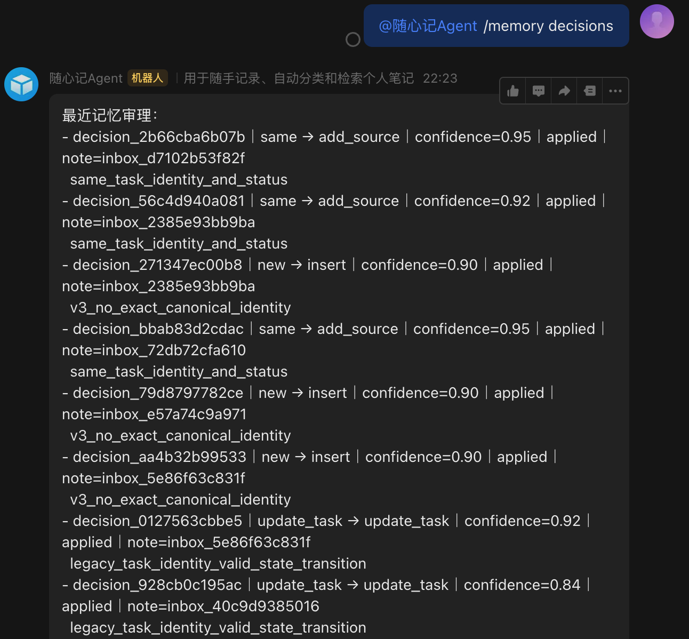

# 随心记 Agent

一个运行在飞书中的个人记忆助手。它把聊天中的原始记录保存为可追溯 Note，再将值得长期保留的信息抽取为可演化的 Memory，用于回答历史问题、维护任务进展和展示当前画像。

> 记录不等于记忆。Note 保留用户说过什么；Memory 经过候选校验、关系审理和版本化演化后，才会影响后续回答。

## 项目能力

| 能力 | 说明 |
| --- | --- |
| 可靠记录 | 消息先进入 Inbox/WAL，再异步完成分类、向量、关联和记忆处理。 |
| 长期记忆 | 支持偏好、任务、稳定事实和带时间背景的经历四类 Memory。 |
| 混合检索 | `/ask` 结合 Note 与 active Memory；复杂问题按子句做有界检索并组织来源。 |
| 记忆演化 | 新信息可被审理为 `new`、`same`、`merge`、`update_task`、`supersede` 或 `conflict`。 |
| 可审计 | Trace 展示完整处理步骤与候选，来源、版本、决策和关系都可回看。 |
| 安全控制 | 密码、密钥、令牌和高风险证件信息在入口本地拦截，不写入、不嵌入、不发送给模型。 |

## 飞书演示

以下均为真实飞书交互截图。

### 1. 像聊天一样记录

发送自然语言消息后，系统先确认接收，再异步整理为 Note 和长期记忆。

<p align="center">
  
</p>

### 2. 简单问题：从历史中直接回答

单一问题优先查询长期记忆，并在答案末尾标明实际引用的来源。

<p align="center">
  
</p>

### 3. 复杂问题：拆解并混合检索

多问题消息会按子句拆解，分别检索 Memory 和相关 Note。答案中的来源最多展示 5 条 Memory 与 5 条 Note，不会为了凑数量加入无关记录。

<p align="center">
  
</p>

### 4. 普通输入生成的记忆候选

`/trace latest` 显示全部处理步骤，以及本条消息生成的候选、关系和最终动作。

<p align="center">
  
</p>

### 5. 任务状态演化

同一任务可从待办演化为阻塞、完成或取消；“正在做”作为待办的进展描述，只增加来源，不会创建重复任务。

旧版四状态之前的演示截图已下线，待下一次真实飞书验收后补充新版截图。

### 6. 记忆审计与追溯

候选、关系决策、写入动作和来源均可追溯；不确定的破坏性变更会进入人工审阅。

<p align="center">
  
</p>

### 7. 动态用户画像

`/memory profile` 汇总当前有效的偏好、当前未完成任务和稳定事实，方便用户校验系统目前记住了什么。

旧版画像截图已下线，避免展示已移除的状态值。

## 工作方式

```text
Feishu message
  -> Inbox / WAL
  -> Note (原始证据)
  -> Memory candidate
  -> Validation + relation adjudication
  -> Versioned memory

/ask
  -> Query planning
  -> Memory + Note retrieval
  -> Evidence selection
  -> Answer with sources
```

长期记忆包含四类：

| 类型 | 用途 | 示例 |
| --- | --- | --- |
| `preference` | 喜欢、讨厌、习惯和约束 | 不喜欢喝牛奶 |
| `task` | 待办、阻塞、完成、取消 | 修改 Agent 简历 |
| `semantic` | 稳定事实、项目和学习重点 | 正在投递 Agent 简历 |
| `episodic` | 有时间背景的重要经历 | 今天逛了植物园并拍花 |

原始 Note 不会被覆盖。Memory 的变更写入决策、版本和来源；低置信度的破坏性变更进入 `pending_review`，等待人工确认。

## 常用命令

| 目的 | 命令 |
| --- | --- |
| 随手记录 | 直接发送文本 |
| 询问历史 | `/ask 上次我提到 Agent 简历时在做什么？` |
| 查看候选与步骤 | `/trace latest` |
| 查看某次 Trace | `/trace <trace_id>` |
| 查看画像 | `/memory profile` |
| 搜索记忆 | `/memory search <关键词>` |
| 审阅待确认变更 | `/memory pending`、`/memory approve <id>` |
| 查看决策 | `/memory decisions` |
| 修正或删除记忆 | `/memory correct <id> <内容>`、`/memory forget <id>` |
| 周期回顾 | `/summary 今天|一周|一个月` |

## 快速启动

```bash
python3 -m venv .venv
source .venv/bin/activate
make install-dev
cp .env.example .env
python scripts/check_config.py
make test
make start
```

`.env` 至少需要飞书应用配置。真实 LLM 与 embedding 调用还需要 OpenAI 或 OpenAI-compatible 服务配置；测试和 dry-run 评测不调用真实 API。

## 存储与部署

本地学习或单实例使用：

```dotenv
STORAGE_BACKEND=local
COORDINATION_BACKEND=local
TASK_QUEUE_BACKEND=local
```

多实例部署使用 PostgreSQL 与 Redis：

```dotenv
STORAGE_BACKEND=postgres
COORDINATION_BACKEND=redis
TASK_QUEUE_BACKEND=redis_streams
REDIS_URL=redis://...
```

```bash
make db-upgrade
make distributed-start
make distributed-status
```

完整切换步骤见 [分布式切换手册](docs/distributed_cutover_runbook.md)。本地临时 PostgreSQL 可显式启动：

```bash
docker compose --profile local-infra up -d postgres
```

## 可靠性、Trace 与评测

- `message_id`、Delivery Key 和持久化状态避免常规重试导致的重复写入或重复发送。
- Memory 抽取支持 `rules`、`llm` 与 `hybrid` 模式。专用抽取请求默认 30 秒超时，只对 `APITimeoutError` 受控重试一次；失败会安全降级到规则候选。
- `/trace latest` 完整展示步骤名称、状态、耗时和本条消息的候选摘要；敏感内容会脱敏。
- 评测覆盖分类、检索、总结、ReAct 查询、候选提取、关系审理、任务生命周期和端到端场景。详细 dry-run 指标见 [docs/metrics/latest.json](docs/metrics/latest.json)。

运行验证：

```bash
make lint
make test
make eval-dry-run
```

`make eval-dry-run` 会运行五个离线评测脚本，不产生真实 LLM 调用。真实线上质量和延迟需要基于生产流量或独立基准单独测量，项目不会把未测延迟写成性能结论。

## 当前边界

- 目前只处理文本消息，语音、图片和文件尚未接入。
- `local` 后端适合学习和小规模使用；多实例部署应使用 PostgreSQL。
- LLM 候选质量仍受模型与 prompt 影响，复杂消息应持续通过真实样例和评测集校准。
- 飞书接口无法在本地提供严格 exactly-once 语义；系统通过幂等键、状态机和有限重试降低重复发送风险。

## Roadmap

- 扩充真实反馈集，持续评测复杂查询和多子句记忆抽取。
- 为语音、图片和文件提供可审计的多模态记录路径。
