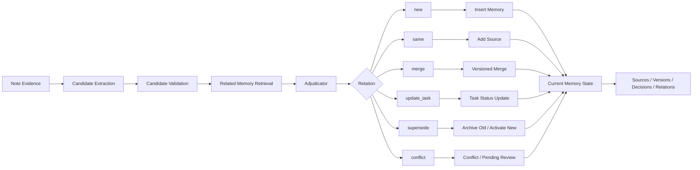
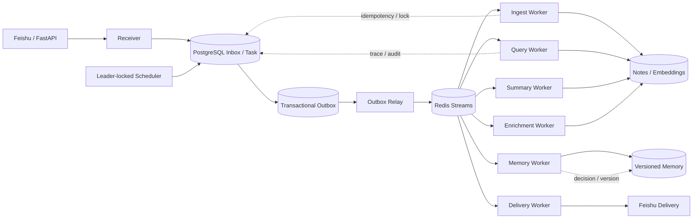

# 随心记 Agent · Suixinji

> 一个运行在飞书中的个人知识与长期记忆 Agent：可靠接收碎片化记录，持续整理笔记、演化长期记忆，并通过可追溯的多路检索回答历史问题。

<!--
【素材 1：项目头图】
文件路径：docs/assets/suixinji-banner.png
建议尺寸：1600×500 或 1800×560

头图只负责说明“项目是什么”，不要放终端截图，也不要画完整分布式架构。

建议内容：
- 主标题：随心记 Agent
- 英文副标题：Personal Knowledge & Long-term Memory Agent
- 中间主链路：Capture → Organize → Remember → Retrieve
- 四个能力标签：
  Reliable Ingestion
  Evolving Memory
  Hybrid Retrieval
  Auditable Trace
- 可使用飞书消息、笔记、记忆节点、搜索等简洁线性图标
- 不要放 API Key、代码、性能数字和复杂数据库表
-->
<p align="center">
  
</p>

<p align="center">
  <a href="https://github.com/9leaa/suixinji/actions/workflows/ci.yml">
    
  </a>
  
  
  
  
  
</p>

---

## Demo

<!--
【素材 2：唯一的核心运行 Demo】
文件路径：docs/assets/demo/suixinji-demo.gif
建议时长：35～60 秒

建议展示一个连续故事，不要剪成多个互不相关的命令：

1. 用户在飞书发送：“我最近重点学习 Agent，并准备完善随心记的记忆系统。”
2. Bot 很快回复“已整理到随心记”，体现接收链路不会等待全部 LLM 增强完成
3. 再发送：“我现在更喜欢用 Python 做项目，不准备学 Java。”
4. 展示 /memory profile 或 /memory search，看到 preference / task / semantic 等长期记忆
5. 发送一条会更新旧状态的消息，例如：“随心记的记忆系统已经完成第一阶段”
6. 展示 /memory decisions 或 /trace latest，看到 update_task / supersede / merge 等决策
7. 最后使用 /ask：“我最近重点做什么？随心记进展怎么样？”
8. 展示带来源的回答

录制要求：
- 飞书窗口和终端可左右并排，但画面不要过密
- 删除 app_id、API Key、数据库地址、真实用户 ID
- 跳过长时间等待，只保留关键状态变化
- README 后面不再放多个“普通使用场景”截图，避免与 Demo 重复
-->
<p align="center">
  
</p>

Demo 覆盖的主流程：

```text
Feishu Message
  → Durable Inbox / WAL
  → Provisional Note
  → Async Enrichment
  → Memory Candidate
  → Adjudication & Evolution
  → ReAct / Hybrid Retrieval
  → Answer with Sources
```

---

## Why Suixinji

普通笔记工具保存的是一条条静态文本，但用户的真实认知会不断变化：

- “我喜欢喝牛奶”可能被更新为“我最近不喝牛奶”
- “准备完善记忆系统”会从 `todo` 变成 `in_progress` 或 `done`
- 多条相近记录可能是在重复确认，也可能是补充、替代或冲突
- 新消息已经接收后，即使 LLM、Embedding 或网络暂时失败，也不应丢失

随心记将“记录文本”拆分成三个层次：

```text
Inbox / Note
保存用户说过什么
        ↓
Memory Candidate
判断哪些内容值得成为长期记忆
        ↓
Versioned Memory
维护用户当前有效的偏好、事实、任务和经历
```

项目不只是“把聊天记录存进数据库”，而是处理 **可靠接收、异步整理、长期记忆演化、多路检索和全链路审计**。

---

## Core Capabilities

### 1. Reliable Asynchronous Ingestion

普通文本先进入 Inbox/WAL，再由本地规则生成 provisional 笔记；LLM 分类、Embedding、相关笔记搜索和 Memory Extraction 在独立任务中补全。

```text
Message Received
  → Inbox / WAL persisted
  → Local provisional classification
  → Note available for query
  → Async classification / embedding / related search
  → Memory extraction and evolution
```

可靠性机制包括：

- `message_id` 唯一约束与幂等写入
- WAL / PostgreSQL Inbox 先落库，再提交后台任务
- 有界任务队列与 Pending Drainer
- 同一 `space_id` 的关键写入串行化
- 失败、partial 和 stale processing 状态可恢复
- Delivery Key 防止回答、总结和归档提示重复发送

### 2. Evolving Long-term Memory

原始 Note 只作为证据，不会直接成为用户“当前事实”。

支持四类长期记忆：

| Memory Type | Example |
|---|---|
| `preference` | 喜欢、讨厌、习惯、过敏与偏好变化 |
| `task` | 待办、进行中、阻塞、完成与取消 |
| `semantic` | 当前项目、学习重点、位置与稳定事实 |
| `episodic` | 有时间背景的重要经历和事件 |

记忆处理链路：

```text
Note
  → Candidate Extraction
  → Candidate Validation
  → Related Memory Retrieval
  → Relation Adjudication
  → Deterministic Evolution
  → Version / Source / Decision / Relation
```

关系审理支持：

| Relation | Meaning | Typical Action |
|---|---|---|
| `new` | 新认知 | 插入新记忆 |
| `same` | 重复或再次确认 | 增加来源 |
| `merge` | 同一主题的兼容补充 | 合并并生成版本 |
| `update_task` | 任务状态发生有效迁移 | 更新任务版本 |
| `supersede` | 新认知明确替代旧认知 | 旧记忆失效，新记忆生效 |
| `conflict` | 信息矛盾且无法安全自动判断 | 保留冲突或进入人工审阅 |

低置信度的破坏性操作不会直接修改现有记忆，而是进入 `pending_review`。

### 3. Hybrid Retrieval and ReAct Query

查询系统根据问题选择不同路径：

- 明确类型或标签：确定性结构化过滤
- 最近笔记：时间范围检索
- 普通自然语言问题：Embedding 语义检索
- 当前偏好、任务或事实：优先检索 active long-term memory
- 复杂多跳问题：ReAct Agent 调用 `semantic_search`、`memory_search`、`get_note` 和 `follow_links`
- 最新但尚未完成增强的笔记：本地词法路径兜底

```text
Question
  → Deterministic Route / ReAct
  → Active Memory Prefetch
  → Structured / Lexical / Vector Search
  → Evidence Selection
  → Answer Generation
  → Sources
```

最终回答只能基于检索到的 Observation，并可附上 Note 或 Memory 来源。

### 4. Model Routing

不同任务按能力和成本选择模型角色：

| Model Role | Default Model | Typical Work |
|---|---|---|
| `fast` | `gpt-5.4-mini` | 分类、记忆候选抽取等结构化任务 |
| `balanced` | `gpt-5.4` | 常规查询与总结 |
| `strong` | `gpt-5.5` | 更复杂的推理或高质量生成 |

模型名称可通过环境变量替换，并兼容 OpenAI-compatible 服务。

### 5. Sensitive Data Protection

密码、API Key、Bearer/JWT、带凭据的连接串及高风险身份证件、银行卡值会在入口处本地拦截：

- 不保存原文
- 不生成 Embedding
- 不发送给 LLM
- 不进入检索、总结、关联和长期记忆
- 对遗留敏感内容继续执行读取侧过滤

---

## Memory Evolution

<!--
【素材 3：长期记忆演化图】
文件路径：docs/assets/architecture/memory-evolution.png
建议尺寸：1700×950

这是 README 中最重要的静态图，应重点表现“静态笔记”和“动态记忆”的区别。

必须包含：
Note
→ Candidate Extraction
→ Validation
→ Related Memory Retrieval
→ Adjudicator
→ new / same / merge / update_task / supersede / conflict
→ Evolution
→ Memory Version / Source / Decision / Relation

侧边补充：
- low confidence destructive action → pending_review
- Note 只作为 Evidence
- Active Memory 才参与默认查询
- 每次变化都会产生 Version 和 Decision

不要把数据库表全部画出来，也不要使用太多交叉箭头。
-->
<p align="center">
  
</p>



---

## Auditable Trace

随心记不只保存最终结果，还记录“为什么记住、为什么修改、为什么召回”。

### Memory Write Trace

```text
message_received
  → wal_appended
  → task_queued
  → provisional_note_saved
  → memory_extraction_started
  → candidate_extracted
  → candidate_memories_found
  → relation_decided
  → evolution_started
  → memory_inserted / merged / updated / superseded / conflicted
  → extraction_state_completed
```

<!--
【素材 4：记忆写入 Trace 截图】
文件路径：docs/assets/trace/memory-write-trace.png

建议使用 `/trace latest` 或 `/trace <trace_id>` 的真实输出。

截图必须展示：
- trace_id、note_id、space_id
- extractor_mode
- candidate_id、memory_type、confidence
- candidate_memories_found
- relation_decided
- recommended_action
- target_memory_ids
- evolution result
- 每一步的 status、duration_ms 或 reason

最佳案例：
先存在“正在完善随心记记忆系统”，再写入“第一阶段已经完成”，
Trace 中出现 task 状态更新或 merge/supersede，能直观看出系统不是简单追加文本。
-->
<p align="center">
  
</p>

### Query Trace

查询 Trace 记录路由、检索、证据选择和回答生成：

```text
query_received
  → query_routed
  → memory_search / note_search
  → rerank
  → evidence_selected
  → answer_generated
  → answer_returned
```

<!--
【素材 5：查询 Trace 截图】
文件路径：docs/assets/trace/query-trace.png

使用一个既召回 Memory 又召回 Note 的问题，例如：
“我最近重点学习什么，随心记的记忆系统进展怎么样？”

截图建议展示：
- query_received
- deterministic route 或 ReAct steps
- active memory prefetch
- memory_search / semantic_search
- 召回 ID 与 score
- rerank 或 evidence_selected
- 最终 answer
- 来源列表

目的：证明最终答案可以追溯到具体 Note/Memory，而不是 LLM 自由编造。
-->
<p align="center">
  
</p>

可用命令：

```text
/trace latest
/trace <trace_id>
/trace memory <memory_id>
/memory decisions
/memory show <memory_id>
```

---

## Distributed Architecture

单机模式适合本地开发；分布式模式使用 PostgreSQL、Redis Streams、独立 Worker 和 Transactional Outbox 解耦接收、处理与发送。

<!--
【素材 6：分布式架构图】
文件路径：docs/assets/architecture/distributed-architecture.png
建议尺寸：1800×1000

建议从左到右分为四层：

入口层：
Feishu / FastAPI
→ Receiver

可靠存储层：
PostgreSQL Inbox
PostgreSQL Task
Transactional Outbox
Memory / Note / Delivery / Agent Run

消息层：
Outbox Relay
→ Redis Streams

执行层：
Ingest Worker
Query Worker
Summary Worker
Memory Worker
Enrichment Worker
Delivery Worker
Leader-locked Scheduler

需要画出的可靠性标记：
- idempotency key
- consumer group
- retry / reclaim / dead letter
- delivery reservation
- distributed lock
- PostgreSQL unique constraint as final guard

不要画成普通“Web → Redis → Database”三层图，要体现 Outbox 和不同 Worker 职责。
-->
<p align="center">
  
</p>



分布式角色：

```text
Receiver
  → PostgreSQL Inbox + Task + Outbox

Outbox Relay
  → Redis Streams

Workers
  → Ingest / Query / Summary / Memory / Enrichment / Delivery

Scheduler
  → Leader lock + periodic summary / consolidation
```

---

## Observability and Reliability

<!--
【素材 7：运行状态截图，可选】
文件路径：docs/assets/observability/status.png

该图不是必须项。只有实际输出清楚时再放。

建议展示：
- /status
- pending count
- queue size / capacity
- succeeded / failed / rejected
- Redis Stream lag / pending
- retry / dead-letter
- 最近错误
- LLM token/cost 或 latency（实际有数据时再展示）

不要使用全是 0 的空状态截图。
-->
<p align="center">
  
</p>

工程机制包括：

- PostgreSQL 唯一约束作为最终幂等保证
- Redis 请求限流、LLM 并发槽位、查询缓存和临时 Session
- Redis 故障时，非关键缓存与 Session 可跳过
- 关键分布式锁可回退 PostgreSQL advisory lock
- Redis Streams Consumer Group、失败重试与过期任务 reclaim
- Delivery reservation 与发送状态对账
- Scheduler 单订阅异常隔离与 Leader Lock
- JSONL 结构化日志和 PostgreSQL Agent Run 审计

---

## Quick Start

### Local Mode

```bash
git clone https://github.com/9leaa/suixinji.git
cd suixinji

python3 -m venv .venv
source .venv/bin/activate

make install-dev
cp .env.example .env

python scripts/check_config.py
make test
make eval-dry-run
make start
```

`.env` 至少需要配置飞书应用参数。真实 LLM 和 Embedding 调用还需要 OpenAI 或 OpenAI-compatible 服务配置。

### PostgreSQL + Redis Mode

```dotenv
STORAGE_BACKEND=postgres
COORDINATION_BACKEND=redis
TASK_QUEUE_BACKEND=redis_streams

DATABASE_URL=postgresql+psycopg://...
REDIS_URL=redis://...
```

```bash
make db-upgrade
make distributed-start
make distributed-status
```

Docker 启动分布式角色：

```bash
make distributed-up
```

停止：

```bash
make distributed-stop
make distributed-down
```

<details>
<summary>常用飞书命令</summary>

```text
/ask 上次我说吃馅饼是什么时候？
/type 生活
/tag 饮食
/filter type=生活 tags=饮食,日常

/summary 今天
/summary 一周
/summary_auto on
/summary_auto time 22:00

/memory list
/memory search Python Agent
/memory profile
/memory pending
/memory approve <memory_id>
/memory decisions
/memory conflicts
/memory consolidate daily

/trace latest
/trace <trace_id>
/trace memory <memory_id>

/status
```

</details>

<details>
<summary>模型与 Embedding 配置</summary>

```dotenv
OPENAI_API_KEY=
OPENAI_BASE_URL=

SUIXINJI_FAST_MODEL=gpt-5.4-mini
SUIXINJI_BALANCED_MODEL=gpt-5.4
SUIXINJI_STRONG_MODEL=gpt-5.5

DASHSCOPE_API_KEY=
EMBEDDING_BASE_URL=
EMBEDDING_MODEL=text-embedding-v3
EMBEDDING_DIMENSION=1024
```

</details>

---

## Evaluation

```bash
make lint
make test
make eval-dry-run
```

CI 在 Python 3.10 和 3.11 上执行 Ruff、数据库迁移、pytest coverage 和五类 dry-run 评测。

当前仓库记录的评测结果：

| Metric | Result |
|---|---:|
| Classification Accuracy | 88.89% |
| Retrieval Pass Rate | 95% |
| Query Pass Rate | 90% |
| Summary Pass Rate | 100% |
| Memory Extraction F1 | 100% |
| Memory Recall@5 | 100% |
| Memory Conflict Accuracy | 100% |
| Memory Lifecycle Accuracy | 100% |
| Pending Recovery Rate | 100% |
| Duplicate Prevention Rate | 100% |

> 这些指标主要来自固定评测样例和确定性 dry-run，用于验证流程与规则正确性；它们不等同于真实线上 LLM 的通用质量。当前 p50/p95 延迟尚未完成正式测量，不将空值包装成性能结论。

评测入口：

```text
eval/eval_classification.py
eval/eval_retrieval.py
eval/eval_summary.py
eval/eval_query_react.py
eval/eval_memory.py
```

---

## Project Structure

```text
suixinji/
├── agent/             # ReAct 查询 Agent 与 Hook
├── apps/              # API、Outbox Relay、Worker、Scheduler
├── bot/               # 飞书接入与消息发送
├── core/              # 配置、LLM Client、敏感内容与可观测性
├── infrastructure/    # PostgreSQL、Redis、锁与 Schema
├── memory/            # 候选抽取、审理、演化、版本与 Trace
├── repositories/      # Local / PostgreSQL Repository
├── runtime/           # Executor、Delivery、Streams 与后台恢复
├── storage/           # Note 与 Vector Store
├── summary/           # 手动总结与自动总结
├── eval/              # 分类、检索、查询、总结和记忆评测
├── scripts/           # 启动、迁移、压测、Chaos 与 Cutover
├── tests/             # 单元测试和集成测试
├── alembic/           # PostgreSQL Schema Migration
└── docs/              # 指标、运行手册与设计文档
```

---

## Current Limitations

- 真实 LLM 分类和候选抽取仍受 Prompt、模型及 Taxonomy 边界影响
- 默认记忆候选抽取以规则模式为主，LLM / hybrid 模式仍需要更多真实反馈评测
- 当前展示指标主要来自固定样例，线上延迟和吞吐仍需正式压测
- Local JSON 向量索引只适合开发与学习；多进程和较大数据量应使用 PostgreSQL + pgvector
- 飞书仍是主要产品入口，暂未提供完整的 Web 管理界面

---

## Roadmap

- [ ] 扩充真实用户反馈与长期记忆评测集
- [ ] 完成 Ingest / Query 的 p50、p95、p99 延迟与吞吐测量
- [ ] 优化 LLM / hybrid 记忆候选抽取与关系审理
- [ ] 完善 Memory、Query 和 Distributed Trace 可视化
- [ ] 持续验证 Worker 故障接管、Outbox 恢复和 Scheduler Leader 切换
- [ ] 增强多租户隔离、配额控制与成本观测

---

## Documentation

- [Current Metrics](docs/metrics/latest.json)
- [Distributed Cutover Runbook](docs/distributed_cutover_runbook.md)

---

## Asset Directory

创建以下目录，并将图片或 GIF 放入对应位置：

```text
docs/assets/
├── suixinji-banner.png
├── demo/
│   └── suixinji-demo.gif
├── architecture/
│   ├── memory-evolution.png
│   └── distributed-architecture.png
├── trace/
│   ├── memory-write-trace.png
│   └── query-trace.png
└── observability/
    └── status.png
```

优先级：

```text
1. suixinji-demo.gif
2. memory-evolution.png
3. memory-write-trace.png
4. query-trace.png
5. distributed-architecture.png
6. suixinji-banner.png
7. status.png（可选）
```

---

## Tech Stack

Python · OpenAI SDK · Feishu Open Platform · FastAPI · Pydantic · PostgreSQL · pgvector · Redis Streams · SQLAlchemy · Alembic · Pytest · Docker

---

## License

请根据项目实际使用方式补充 License。公开展示和允许复用时，可考虑 MIT License。
