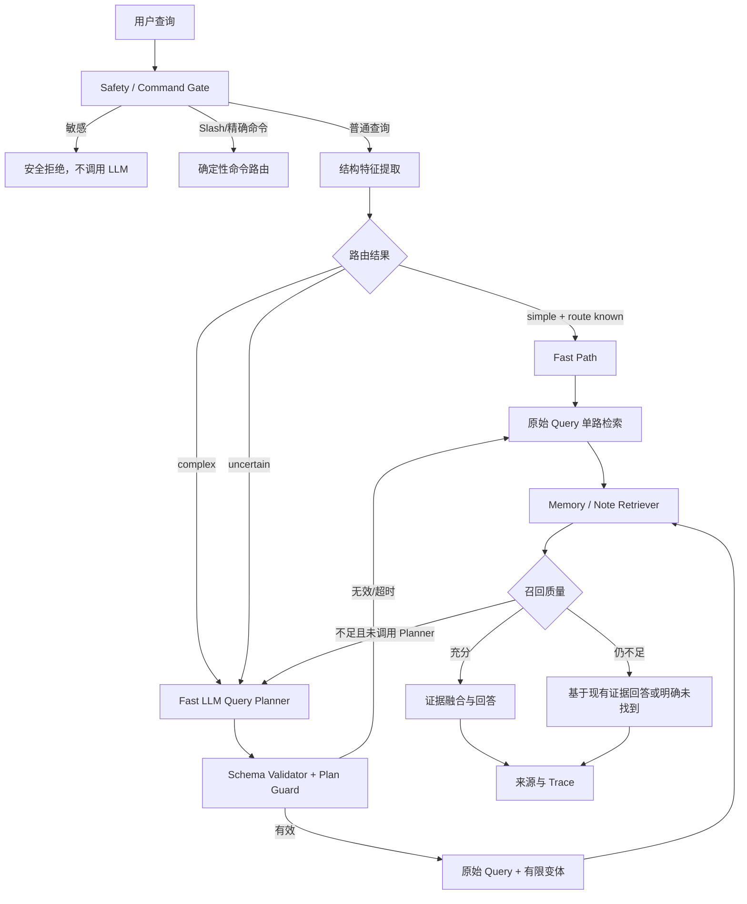

# 随心记复杂查询识别与分解设计方案

> 文档状态：设计稿  
> 适用版本：Memory V3 查询链路  
> 目标：让简单问题稳定走快速路径，让真正复杂的问题按需触发 Query Rewrite、子问题分解和 Step-back，同时控制 LLM 延迟、成本和不确定性。

---

## 1. 结论

随心记不应使用“纯关键词规则”，也不应让所有查询都经过 LLM Planner。

采用三级级联路由：

```text
安全与命令 Gate
    ↓
确定性 Fast Path
    ↓
结构特征路由器
    ↓
只有复杂或不确定问题调用 Fast LLM Planner
    ↓
原始 Query + 有限查询变体
    ↓
分路检索、RRF 融合、必要时重排、基于证据回答
```

核心原则：

1. 明显简单的问题不调用规划 LLM；
2. 复杂度不能只根据句子长度或单个关键词判断；
3. QueryIntent 与复杂规划共用一次结构化模型调用，避免重复调用；
4. 原始 Query 永远保留，模型生成内容只能作为额外检索通道；
5. LLM 只能产生检索计划，不能修改任务状态、偏好极性、Memory 关系或冲突结论；
6. 任何模型失败都必须回退到原始 Query 检索；
7. 敏感查询在调用外部 LLM 前拦截，敏感原文不得进入模型、缓存或 Trace。

---

## 2. 当前实现与 P4 基线

当前链路包含两套判断：

- `agent/query_intent.py`
  - 使用 fast LLM 输出结构化 QueryIntent；
  - 当前环境已开启 `SUIXINJI_QUERY_INTENT_MODEL_ENABLED=true`；
- `agent/query_planner.py`
  - 使用固定关键词、长度和正则判断复杂度；
  - 生成 Query Rewrite、decomposition 和 Step-back 变体。

这会产生两个问题：

1. QueryIntent 已理解语义，但复杂度判断没有使用它；
2. 明显简单的自然语言问题仍可能先调用 QueryIntent LLM，增加延迟。

P4 测试基线：

| 指标 | 当前结果 |
|---|---:|
| 测试数量 | 240 |
| 复杂度分类准确率 | 82.5% |
| Complex Precision | 88.2% |
| Complex Recall | 75.0% |
| Complex F1 | 81.1% |
| 简单问题误判为复杂 | 10.0% |
| 复杂问题误判为简单 | 25.0% |
| 复杂问题规划覆盖率 | 58.3% |
| 子问题分解召回率 | 33.3% |
| Step-back 召回率 | 75.0% |
| Query Rewrite 召回率 | 100% |

主要失败类型：

- “并且、另外、再、最后”等多问题结构没有被识别；
- 仅使用问号分隔的多个问题没有被拆分；
- 英文 `Compare A and B` 没有触发 decomposition；
- “不要比较、不要分析原因”被关键词误判为复杂；
- 已判为复杂的问题不一定生成任何有效变体；
- 简单问题可能生成 `retrieval_queries`，但 `use_query_rewrite=false`，计划字段不一致。

P4 是包含边界样例的开发集，不能直接视为线上真实准确率，但可以可靠暴露当前规则路由器的结构性缺陷。

---

## 3. 什么是复杂查询

复杂查询不等于“句子长”，也不等于“出现为什么”。

定义：

> 如果完整回答需要两个及以上相互独立的证据集合，或需要对证据进行时间、因果、比较、关系、聚合推理，则属于复杂查询。

### 3.1 简单查询

满足以下特征时优先判为简单：

- 单一意图；
- 单一主题或实体；
- 单一时间范围；
- 一次 Memory 或 Note 检索能够得到完整答案；
- 不要求比较、解释原因、分析变化或组合多个证据。

示例：

```text
Agent 简历现在是什么状态？
我现在喜欢喝什么？
查一下 RAG 混合检索的笔记。
最近一条随心记是什么？
```

### 3.2 复杂查询

存在以下任一强特征时判为复杂：

- 多个独立子问题；
- 多实体比较；
- 多时间段变化或趋势；
- 原因、影响、关联分析；
- 同时需要 Memory 当前状态和 Note 历史证据；
- 需要先查 A，才能确定如何查 B；
- 需要对多个证据集合进行汇总；
- 存在跨轮指代，无法从当前句独立确定主题。

示例：

```text
结合最近的学习记录，分析为什么 Agent 简历一直没有完成，并给出下一步。
比较 Query Rewrite 和 Step-back 的使用场景。
RAG 当前学到哪里了，最近遇到了哪些问题？
先查 Agent 简历状态，再找相关笔记，最后说明阻塞原因。
```

### 3.3 不确定查询

以下情况进入 `uncertain`，交给 fast LLM：

- 句子短，但存在“那个、之前说的、它、这件事”等指代；
- 有多个实体，但不确定是过滤条件还是多个独立目标；
- 有多个问句，但可能只是同一意图的不同表达；
- 规则无法确定应该查 Memory 还是 Note；
- QueryIntent 置信度不足；
- 第一轮检索返回了非空但低质量或证据不完整的结果。

---

## 4. 总体架构



---

## 5. 第一级：安全与确定性 Fast Path

### 5.1 必须在 LLM 之前处理

- 敏感凭据查询；
- Slash 命令；
- 精确 Note ID / Memory ID 查询；
- 最近 Note 列表；
- 按 type/tag/time 的 Metadata 查询；
- read-after-write provisional Note 查询；
- 空问题和非法输入。

### 5.2 明显简单且路由可确定

结构化规则可以直接识别：

- 明确任务状态查询 → Task Memory First；
- 明确偏好查询 → Preference Memory First；
- 明确当前事实 → Semantic Memory First；
- 明确历史原文 → Note First；
- 明确最近笔记 → Note Metadata；
- 精确标识符 → Exact First。

Fast Path 条件必须同时满足：

```text
intent_count == 1
entity_count <= 1
question_clause_count <= 1
time_scope_count <= 1
无比较/因果/趋势/关系/聚合要求
无未解析指代
route_confidence >= FAST_PATH_THRESHOLD
```

建议：

```text
FAST_PATH_THRESHOLD = 0.90
```

这里的 confidence 来自确定性特征覆盖率，不是向量相似度。

---

## 6. 第二级：结构特征路由器

新增统一特征对象：

```python
class QueryRouteFeatures(BaseModel):
    normalized_query: str
    language: Literal["zh", "en", "mixed", "unknown"]

    question_clause_count: int
    entity_candidates: list[str]
    intent_candidates: list[str]
    time_scopes: list[str]

    has_comparison: bool
    has_causal_request: bool
    has_trend_request: bool
    has_relationship_request: bool
    has_summary_request: bool
    has_multi_step_request: bool
    has_anaphora: bool

    negated_operations: list[str]
    explicit_identifiers: list[str]
```

### 6.1 多问句识别

不能只使用 `并且|同时|以及`。

至少处理：

```text
并且、同时、另外、还有、以及、再、然后、最后
？、?、；、;、换行
and、also、then、finally
```

拆分后还要验证：

- 每一段是否包含可独立检索的目标；
- 多段是否只是同一问题的重复说法；
- 是否存在依赖关系。

### 6.2 否定范围

关键词必须识别否定范围：

```text
不要比较
无需分析原因
不需要总结
只查 A
```

这些表达不能因为包含“比较、原因、总结”就自动判为复杂。

第一阶段使用局部窗口规则：

```text
否定词出现在操作词之前 0～4 个字符
→ 将该操作加入 negated_operations
→ 不作为复杂特征
```

LLM Router 仍要在不确定时复核，防止中文长距离否定造成误判。

### 6.3 多实体不等于复杂

```text
查 RAG 项目里的 SQL 索引笔记
```

可能只是一个复合主题，而不是两个子问题。

只有满足下列条件之一时，多实体才升级为复杂：

- 存在比较或关系操作；
- 每个实体属于不同问句；
- 每个实体对应不同时间范围或不同检索目标；
- 需要分别返回证据。

### 6.4 路由结果

```python
class StructuralRouteDecision(BaseModel):
    complexity: Literal["simple", "complex", "uncertain"]
    confidence: float
    target_layers: list[Literal["memory", "note"]]
    suggested_strategies: list[
        Literal["none", "rewrite", "decomposition", "step_back"]
    ]
    reasons: list[str]
```

规则路由器只输出决策和理由，不直接生成自然语言子问题。

---

## 7. 第三级：Fast LLM Query Planner

### 7.1 何时调用

满足任一条件时调用一次 fast LLM：

- 结构路由结果为 `complex`；
- 结构路由结果为 `uncertain`；
- 存在未解析指代；
- 多实体、多意图或多时间范围；
- 第一轮召回为空；
- 第一轮召回非空，但质量 Gate 判断证据不足；
- 用户明确要求比较、解释原因、趋势、关系或汇总。

以下情况不调用：

- 安全 Gate 已拦截；
- Slash 命令；
- 精确 ID 查询；
- Metadata 列表查询；
- 明确单实体任务状态、偏好、当前事实查询；
- read-after-write 的即时原文查询。

### 7.2 合并 QueryIntent 与 QueryPlan

不再先调用一次 QueryIntent LLM，再调用另一个 Planner LLM。

一次模型调用同时返回：

- 查询意图；
- 目标实体、主题、时间范围；
- 复杂度；
- 使用哪些规划策略；
- 改写 Query；
- 子问题；
- Step-back 检索框架。

### 7.3 输出契约

```python
class PlannedSubQuestion(BaseModel):
    id: str
    query: str
    intent: Literal[
        "task_status",
        "preference",
        "current_fact",
        "note_history",
        "recent_notes",
        "relationship",
        "summary",
        "general_search",
    ]
    target_layer: Literal["memory", "note", "both"]
    time_scope: Literal["current", "history", "recent", "all"] | None
    depends_on: list[str]
    expected_evidence: str


class LLMQueryPlan(BaseModel):
    schema_version: Literal["query-plan-v2"]
    original_query: str

    complexity: Literal["simple", "complex"]
    confidence: float
    primary_intent: str
    entities: list[str]
    time_scopes: list[str]

    strategies: list[
        Literal["none", "rewrite", "decomposition", "step_back"]
    ]
    rewritten_queries: list[str]
    sub_questions: list[PlannedSubQuestion]
    step_back_query: str | None

    answer_requirement: str
    planning_reason: str
```

### 7.4 模型输出示例

输入：

```text
结合最近的学习记录，分析为什么 Agent 简历一直没有完成，并给出下一步。
```

输出：

```json
{
  "schema_version": "query-plan-v2",
  "original_query": "结合最近的学习记录，分析为什么 Agent 简历一直没有完成，并给出下一步。",
  "complexity": "complex",
  "confidence": 0.96,
  "primary_intent": "summary",
  "entities": ["Agent简历"],
  "time_scopes": ["current", "recent"],
  "strategies": ["decomposition", "step_back"],
  "rewritten_queries": [],
  "sub_questions": [
    {
      "id": "q1",
      "query": "Agent简历当前任务状态是什么",
      "intent": "task_status",
      "target_layer": "memory",
      "time_scope": "current",
      "depends_on": [],
      "expected_evidence": "当前任务状态与最新版本"
    },
    {
      "id": "q2",
      "query": "最近与Agent简历相关的学习和工作记录",
      "intent": "note_history",
      "target_layer": "note",
      "time_scope": "recent",
      "depends_on": [],
      "expected_evidence": "相关Note及时间"
    },
    {
      "id": "q3",
      "query": "Agent简历未完成的阻塞因素",
      "intent": "relationship",
      "target_layer": "both",
      "time_scope": "all",
      "depends_on": ["q1", "q2"],
      "expected_evidence": "状态变化、问题和阻塞证据"
    }
  ],
  "step_back_query": "判断任务未完成原因需要当前状态、历史行动、阻塞记录和时间顺序",
  "answer_requirement": "说明当前状态、证据、可能原因和下一步，不把推测写成事实",
  "planning_reason": "问题包含当前状态、历史证据、因果分析和行动建议"
}
```

---

## 8. Plan Guard

LLM 输出必须经过确定性校验。

### 8.1 数量限制

```text
最多 3 个子问题
最多 2 个 rewritten query
最多 1 个 step-back query
原始 Query 必须保留
总检索 Query 数最多 5 个
```

超出时按优先级裁剪：

```text
原始 Query
> 当前状态子问题
> 历史证据子问题
> 比较/关系子问题
> Rewrite
> Step-back
```

### 8.2 语义保真

禁止：

- 引入原问题和会话上下文中不存在的新人物、项目或状态；
- 将“可能、是否”改成确定事实；
- 改变任务状态；
- 改变偏好正负极性；
- 把历史状态当成当前状态；
- 把 Note 证据当成已审理的长期 Memory；
- 生成或补全密码、令牌、密钥等敏感内容。

### 8.3 结构校验

- JSON Schema/Pydantic 校验必须通过；
- `complexity=simple` 时不得包含 decomposition；
- decomposition 至少包含两个可独立检索的子问题；
- `depends_on` 只能引用已有子问题；
- 每个子问题必须有 target layer；
- Query 去重后不能为空；
- 子问题不能只是原问题的同义重复。

校验失败时：

```text
记录 plan_validation_failed
→ 丢弃模型计划
→ 使用原始 Query
→ 不让用户查询失败
```

---

## 9. 策略选择

| 查询情况 | 策略 |
|---|---|
| 单实体、单意图、当前状态 | 不扩展 |
| 明确主题但表达冗余 | 结构化槽位扩展 |
| 指代不清或首次低召回 | Query Rewrite |
| 多个独立问题 | 子问题分解 |
| 比较、多实体关系 | 子问题分解 |
| 原因、趋势、演变 | Step-back + 必要时分解 |
| 多时间段汇总 | 分解为时间范围子问题 |
| 开放式个人知识探索 | 条件式 Rewrite |
| Task/Preference/Current Fact | 禁用 HyDE |
| 所有普通查询 | HyDE 默认关闭 |

### 9.1 Query Rewrite

Rewrite 只能补充检索表达，不能替代原始 Query。

执行：

```text
原始 Query
+ 结构化实体 Query
+ 最多 2 条生成式 Rewrite
→ 分别召回
→ Weighted RRF
```

### 9.2 子问题分解

每个子问题独立选择检索层：

- 当前任务、偏好、当前事实 → Memory First；
- 历史过程、原文、时间证据 → Note First；
- 关系和总结 → Memory + Note；
- pending_review → 显式返回待确认状态。

### 9.3 Step-back

Step-back 只用于决定“需要什么证据”，不能生成用户事实。

正确：

```text
需要查当前状态、两次历史测试、配置变化和结果指标。
```

错误：

```text
效果不稳定一定是因为更换了模型。
```

后者属于未经检索证明的结论，必须禁止。

---

## 10. 检索执行与融合

### 10.1 Memory 子问题

沿用长期 Memory 设计：

```text
Canonical / Structured Exact
+ Sparse
+ Dense
→ Exact-first + Weighted RRF
→ 确定性状态、时间、偏好规则排序
```

任何 Query Rewrite、向量分数或模型排序都不能修改：

- task_status；
- polarity；
- active/superseded；
- pending_review；
- Relation Guard 结论。

### 10.2 Note 子问题

沿用普通 Note 设计：

```text
Metadata
+ Sparse
+ Dense
→ Weighted RRF
→ 条件式 Cross-Encoder
```

Cross-Encoder 只用于复杂 Note 查询的有限候选，不用于简单精确查询。

### 10.3 多路结果融合

每个结果保留：

```json
{
  "source_query_id": "original/q1/q2/rewrite1/step_back",
  "source_layer": "memory/note",
  "record_id": "...",
  "retrieval_channel": "exact/sparse/dense",
  "rank": 1,
  "score": 0.0
}
```

融合顺序：

1. 子查询内部使用现有 RRF；
2. 不同子查询结果去重；
3. 原始 Query 通道权重最高；
4. 当前状态 Memory 使用确定性规则保持优先级；
5. 复杂 Note 查询可进入 Cross-Encoder；
6. Answer Composer 只能使用最终 Evidence Set。

---

## 11. 首轮召回质量 Gate

简单查询先执行一次低成本检索。如果证据充分，不再调用 Planner。

证据不足条件：

- 结果为空；
- top score 低于类型阈值；
- 结果有多个主题但没有覆盖问题中的主要实体；
- 多问句只覆盖了其中一部分；
- 当前状态查询只找到历史 Note，没有 active Memory；
- 比较问题只找到一侧证据；
- Answer Composer 无法为关键结论绑定来源。

质量 Gate 不能只看 top score，应同时检查：

```text
entity_coverage
intent_coverage
time_scope_coverage
subquestion_coverage
evidence_diversity
```

如果首次检索后调用 Planner，最多调用一次，不能形成循环。

---

## 12. 延迟和调用预算

### 12.1 调用预算

| 路径 | Planner LLM | 最大检索 Query |
|---|---:|---:|
| Slash / 精确查询 | 0 | 1 |
| 明显简单查询 | 0 | 1 |
| 简单但首次低召回 | 1 | 3 |
| 明确复杂查询 | 1 | 5 |
| Planner 失败 | 1 次失败后停止 | 1 |

### 12.2 延迟目标

| 阶段 | P95 目标 |
|---|---:|
| 结构路由器 | < 10 ms |
| Fast Path 额外规划耗时 | < 10 ms |
| Fast LLM Planner | < 1.5 s |
| Planner 超时 | 1.5 s 后回退 |
| 复杂查询整体 | < 4 s，最终回答 LLM 耗时另计 |

### 12.3 缓存

可以缓存结构化计划，但必须：

- key 包含 normalized query、space 和 schema version；
- TTL 建议 5～15 分钟；
- 不缓存包含敏感特征的查询；
- 不在日志中存储原始敏感内容；
- Memory/Note 状态变化不需要重算计划，但检索结果必须实时执行。

---

## 13. 降级策略

| 故障 | 降级 |
|---|---|
| 结构特征提取失败 | 原始 Query 单路检索 |
| Planner LLM 超时 | 原始 Query |
| Planner JSON 非法 | 原始 Query |
| Plan Guard 拒绝 | 原始 Query |
| Query Rewrite 失败 | 保留原始 Query |
| 子问题分解失败 | 原问题单路检索 |
| Step-back 失败 | 原问题 + 已有子问题 |
| Embedding 失败 | Sparse / Metadata / Structured |
| Cross-Encoder 失败 | RRF 顺序 |
| 最终回答 LLM 失败 | 确定性列出证据和来源 |

任何可选模型失败都不能导致已经持久化的数据无法查询。

---

## 14. 可观测性

每次查询记录以下 Trace：

```text
route.features
route.decision
route.confidence
route.reasons
planner.called
planner.model
planner.latency_ms
planner.validation_status
planner.strategies
planner.subquestion_count
planner.variant_count
retrieval.executed_variant_count
retrieval.result_count_by_query
retrieval.entity_coverage
retrieval.subquestion_coverage
retrieval.rrf_merge_count
answer.evidence_count
answer.groundedness
fallback.reason
```

必须区分：

- Planner 生成了多少变体；
- Query Agent 实际执行了多少变体；
- 变体是否带来了新增相关证据；
- 是否只是增加耗时但没有增加召回。

---

## 15. 评测指标

### 15.1 路由指标

| 指标 | 含义 |
|---|---|
| Complexity Accuracy | 简单/复杂总体准确率 |
| Complex Recall | 复杂查询被识别出来的比例 |
| Simple False-complex Rate | 简单查询被误判为复杂 |
| Complex False-simple Rate | 复杂查询被误判为简单 |
| LLM Router Call Rate | 多少查询调用了 Planner |
| Simple-query LLM Call Rate | 简单问题被模型处理的比例 |

### 15.2 规划指标

| 指标 | 含义 |
|---|---|
| Plan Valid Rate | 结构化输出通过校验的比例 |
| Decomposition Recall | 应拆分的问题是否被拆分 |
| Step-back Recall | 原因/趋势问题是否触发 Step-back |
| Rewrite Precision | Rewrite 是否保持原意 |
| Subquestion Coverage | 子问题是否覆盖原问题全部要求 |
| Redundant Subquestion Rate | 重复或无用子问题比例 |

### 15.3 检索收益指标

| 指标 | 含义 |
|---|---|
| Recall Lift | 规划前后相关证据召回提升 |
| nDCG Lift | 规划前后排序提升 |
| Evidence Coverage | 原问题要求的证据是否齐全 |
| Useful Variant Rate | 变体是否带来新增相关证据 |
| Empty-to-hit Rate | 首轮为空，经规划后命中的比例 |
| Added Latency | 规划和额外检索增加的耗时 |

### 15.4 首阶段验收目标

在 P4 v2 开发集上：

| 指标 | 目标 |
|---|---:|
| Complexity Accuracy | ≥ 95% |
| Complex Recall | ≥ 92% |
| Simple False-complex Rate | ≤ 5% |
| Complex False-simple Rate | ≤ 8% |
| Decomposition Recall | ≥ 85% |
| Step-back Recall | ≥ 90% |
| Plan Valid Rate | 100% |
| 简单问题 Planner LLM 调用率 | ≤ 10% |
| 状态/偏好/冲突被规划器修改 | 0 |

开发集达标后，必须使用未参与调参的真实表达 Holdout 验证，不能把 P4 v2 当最终成绩。

---

## 16. 测试集设计

至少覆盖：

### 16.1 简单问题

- 单任务状态；
- 单偏好；
- 单当前事实；
- 单 Note；
- 中英文短句；
- 带礼貌词；
- 长但仍是单一意图；
- 包含否定复杂操作，例如“不要比较”。

### 16.2 复杂问题

- 中文比较；
- 英文比较；
- 中文因果；
- 英文因果；
- 多时间段趋势；
- 多实体关系；
- 多问号；
- “并且、另外、然后、最后”；
- 跨 Memory 和 Note；
- 多轮指代；
- 首次检索低召回；
- 结果非空但证据不完整。

### 16.3 安全与状态

- 敏感查询不得进入 Planner；
- Query Plan 不得写数据库；
- 不得修改 task_status；
- 不得改变 preference polarity；
- 不得把 pending_review 当 active；
- 不得把 superseded 历史版本当当前事实。

---

## 17. 代码改造建议

### 17.1 文件职责

```text
agent/query_route_features.py
    结构特征、问句切分、否定范围、多实体和多时间范围

agent/query_router.py
    三级路由决策、Fast Path、LLM 触发条件

agent/query_intent.py
    保留 QueryIntent Schema；与 LLM Query Plan 合并，避免重复模型调用

agent/query_planner.py
    LLM Planner、Plan Guard、确定性降级

agent/query_agent.py
    执行计划、质量 Gate、变体预算、Trace

memory/prompts.py
    query-plan-v2 Prompt

eval/p4_query_routing_eval.py
    升级为 P4 v2，并增加实际执行变体和检索收益指标
```

### 17.2 统一入口伪代码

```python
def prepare_query_execution(question, context):
    safety = safety_gate(question)
    if safety.blocked:
        return safety.response

    command_route = deterministic_command_route(question)
    if command_route:
        return command_route

    features = extract_route_features(question, context)
    structural = classify_structural_route(features)

    if structural.is_confident_simple:
        return single_query_plan(question, structural)

    llm_plan = plan_with_fast_llm(
        question=question,
        context=safe_context(context),
        structural_hint=structural,
    )
    return validate_or_fallback(llm_plan, original_query=question)
```

首次检索低质量时：

```python
if result_quality_is_low(result) and not execution.plan.llm_called:
    retry_plan = plan_with_fast_llm(...)
    result = execute_bounded_plan(retry_plan)
```

只能重规划一次。

---

## 18. 配置建议

复用现有开关：

```env
SUIXINJI_QUERY_INTENT_MODEL_ENABLED=true
SUIXINJI_QUERY_REWRITE_ENABLED=true
SUIXINJI_QUERY_DECOMPOSITION_ENABLED=true
SUIXINJI_QUERY_STEP_BACK_ENABLED=true
```

新增：

```env
SUIXINJI_QUERY_ROUTER_V2_ENABLED=false
SUIXINJI_QUERY_ROUTER_LLM_ON_UNCERTAIN=true
SUIXINJI_QUERY_ROUTER_LLM_ON_LOW_RECALL=true
SUIXINJI_QUERY_PLANNER_TIMEOUT_MS=1500
SUIXINJI_QUERY_MAX_SUBQUESTIONS=3
SUIXINJI_QUERY_MAX_REWRITES=2
SUIXINJI_QUERY_MAX_TOTAL_QUERIES=5
SUIXINJI_QUERY_PLAN_CACHE_TTL_SECONDS=600
```

启用 V2 Router 后，`QUERY_INTENT_MODEL_ENABLED` 表示“允许使用统一 fast LLM Router”，不再表示“所有自然语言查询都必须调用 LLM”。

---

## 19. 分阶段实施

### Phase 1：结构路由器

- 增加问句切分；
- 增加否定范围；
- 增加中英文比较、因果和多步骤特征；
- 修复 `complexity` 与 `retrieval_queries` 字段不一致；
- 不引入新 LLM 调用；
- 运行 P4 v2。

### Phase 2：统一 LLM Router

- 合并 QueryIntent 和 QueryPlan；
- 只处理 complex/uncertain；
- 添加 query-plan-v2 Schema；
- 添加 Plan Guard、超时和回退；
- 记录模型调用率与耗时。

### Phase 3：低召回二次规划

- 增加检索质量 Gate；
- 首轮低召回时最多重规划一次；
- 统计 Recall Lift、Useful Variant Rate 和 Added Latency。

### Phase 4：灰度

- Shadow 记录新旧路由差异，不影响用户答案；
- 使用真实飞书查询做人工复核；
- 达到验收指标后开启 10%；
- 再逐步提升到 50% 和 100%；
- 保留环境变量一键回退旧 Router。

---

## 20. 最终决策

随心记的复杂查询处理采用：

```text
确定性 Fast Path
→ 结构特征路由
→ 条件式 Fast LLM Planner
→ Plan Guard
→ 原始 Query + 有限变体
→ 分层检索与证据融合
```

不采用：

- 所有查询都调用 LLM；
- 单纯依靠关键词枚举；
- 单纯依靠句子长度判断复杂度；
- 不校验的自由文本 Planner；
- 让模型生成内容直接成为用户事实；
- 让规划器参与 Memory 写入、关系审理或状态变更；
- 默认启用 HyDE；
- 无限子问题分解或循环重规划。

该方案可以同时解决当前 P4 暴露的通用性问题，并保持简单查询的低延迟、复杂查询的证据完整性以及长期 Memory 的状态安全。
