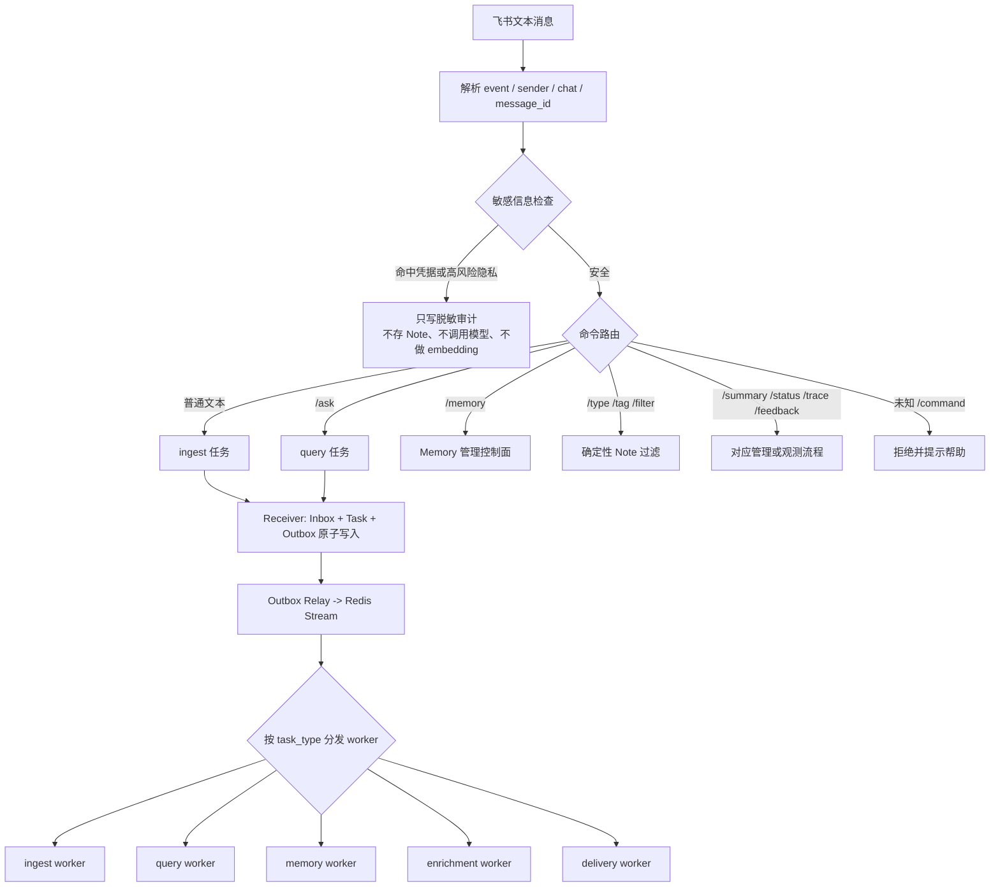
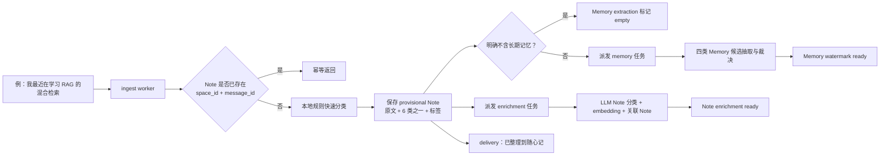
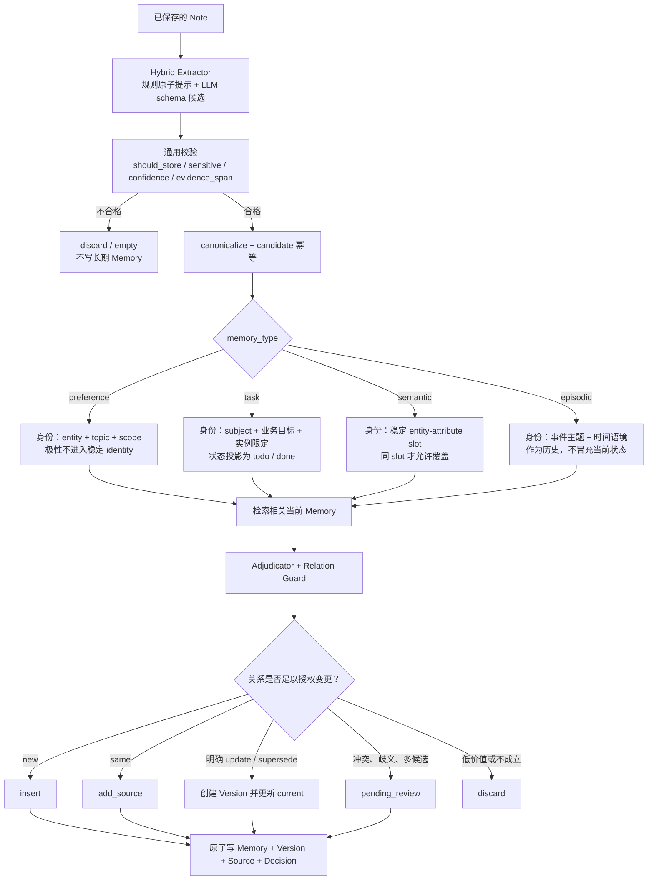
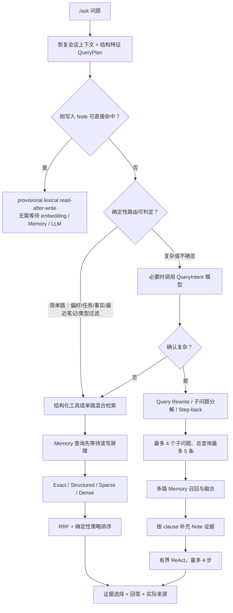

# 随心记项目面试深挖问答（当前代码版）

> 基准日期：2026-08-09  
> 代码基准：远程 `/home/zcj/suixinji`，`main` 分支  
> 用途：项目介绍、系统设计面试、Agent/RAG/长期记忆方向面试  
> 说明：本文按当前代码与当前配置编写。指标是特定离线数据集上的结果，不等价于线上所有输入都达到同样准确率。

---

## 一、先用 60 秒讲清项目

随心记是一个以飞书为入口的个人知识与长期记忆系统。用户可以直接发一段话保存普通 Note，也可以用 `/ask` 查询、用 `/memory` 管理长期 Memory。系统没有把所有文本都塞进向量库，而是分成两层：

- **Note 是证据层**：尽量忠实保存原始输入，分类为任务、学习、灵感、资料、生活、情绪六类；检索使用元数据、全文/词法、向量等多路召回并融合。
- **Memory 是状态层**：从 Note 中抽取可长期复用的 preference、task、semantic、episodic 四类结构化记忆；通过 canonical key、关系判定、Relation Guard、版本和来源链维护“当前事实”和历史演化。

消息链路采用 PostgreSQL + Redis Streams。Receiver 在一个事务中写 Inbox、Task 和 Outbox，再由 relay 投递到 Stream，worker 使用租约、心跳、重试、死信和幂等机制消费。`/ask` 会先做确定性路由；简单问题直接走结构化或混合检索，复杂问题才启用 Query Rewrite、子问题分解和 Step-back，并在有限预算内融合证据、生成带来源的回答。LLM 负责理解和生成候选，不拥有直接修改任务状态、偏好极性或冲突结论的权力。

一句话定位：**它不是一个“聊天记录向量库”，而是一个以原始 Note 为证据、以可审计 Memory 为状态、支持异步消息和一致性控制的个人记忆系统。**

---

## 二、面试前必须分清的概念

| 容易混淆的说法 | 准确定义 |
|---|---|
| “普通输入有四类” | 普通输入先形成 **6 类 Note**；随后可能抽取为 **4 类长期 Memory**。用户常说的“ingest 四类”实际指 ingest 后的四种 Memory 分支。 |
| ingest | 普通消息的写入任务类型，不是 Memory 类型。负责先保存 Note，再派生 memory/enrichment 任务。 |
| `/ask` | 查询命令，对应分布式 `query` 任务；不把问题本身当普通 Note 保存。 |
| `/memory` | 长期记忆的查看、审核、更正、遗忘、清除等管理命令，大部分是同步控制面操作。 |
| Note | 原始证据层，保留用户表达与分类、标签、摘要、embedding、关联 Note。 |
| Memory | 从证据抽取出的结构化状态层，带类型、canonical key、版本、来源和决策记录。 |
| profile/用户画像 | 不是另一套独立真相；它是读取当前 active Memory 后生成的投影。 |
| 相似度 | 只负责找候选，不负责授权更新。真正状态变更必须通过确定性身份和 Relation Guard。 |
| V3 shadow | 当前生产 V3 开关已开启，同时保留 shadow 审计；不是“只有影子逻辑生效”。 |

### 当前运行配置快照

- 存储：PostgreSQL；协调和任务队列：Redis / Redis Streams。
- Memory 抽取：Hybrid；Note 与 Memory 检索：Hybrid。
- V3 schema、canonical key、Relation Guard 均开启；shadow 审计保留。
- QueryIntent、Memory barrier、Router V2、Query Rewrite、子问题分解、Step-back 均开启。
- Note Weighted RRF 与向量通道开启；trigram 当前关闭。
- Memory 向量生命周期开启；统一模型重排当前关闭。
- 当前启动脚本会分别启动 receiver、outbox relay、ingest/query/memory/enrichment/delivery 等 worker。
- 当前检查时服务进程处于停止状态；上述是启动后的部署形态，不代表进程此刻正在运行。

---

## 三、全局消息 DAG

### 普通输入的完整 DAG

### ingest 后四类 Memory 的判定与演化 DAG

### `/ask` 的两条主路必须这样讲

---

# 第一部分：核心高频 55 问

## A. 项目定位与总体架构（1—6）

### 1. 这个项目解决的核心问题是什么？为什么不用飞书搜索或普通 RAG？

飞书搜索解决“原文在哪里”，普通 RAG 解决“哪些文本语义相似”，但个人记忆还需要回答“用户现在喜欢什么”“任务现在是什么状态”“这件事以前是什么状态”。这些问题包含状态覆盖、冲突、时间和来源。随心记因此保留 Note 证据层，同时增加结构化 Memory 状态层。这样既能回到原始证据，又能查询当前状态和演化历史。

追问重点：不要说“用了向量数据库所以更智能”。真正差异是 **证据与状态分层、状态变更有授权条件、结果可追溯**。

### 2. 为什么要设计 Note 和 Memory 两层？一张表不行吗？

两层承担不同语义：Note 追求忠实、完整和可检索；Memory 追求稳定、去重、可演化。若共用一张表，原文更新会污染证据，重复笔记又会制造多个互相冲突的当前状态。分层后，Memory 可以更新版本而不改写 Note，任意 Memory 都能沿 Source 回到证据。

### 3. 系统的核心组件有哪些？

入口是飞书 Bot；Receiver 负责接收和幂等；PostgreSQL 保存 Inbox、Task、Outbox、Note、Memory、Version、Source、Decision 等；Outbox Relay 把任务写入 Redis Streams；不同 worker 处理 ingest、query、memory、enrichment、delivery；模型层提供分类、抽取、意图和回答；trace/metrics 负责观测。入口、队列、业务和交付分离，避免一次慢 LLM 阻塞飞书回调。

### 4. 为什么选择 PostgreSQL + Redis Streams？

PostgreSQL适合事务、唯一约束、版本和来源关系，也能提供全文检索与向量扩展；Redis Streams 适合消费组、待确认列表和 worker 横向扩容。关键写入先落 PostgreSQL，再通过 Outbox 发布，避免“数据库写成功但队列消息丢了”。Redis 是加速和调度层，不是真相源。

### 5. 系统有哪些一致性边界？

至少有四个：飞书消息到 Inbox 的幂等；Inbox/Task/Outbox 的本地事务一致性；同一 space 的顺序和 watermark；Memory 更新中的单 key 锁与数据库原子决策。系统不是全局强一致，而是对用户可感知的同空间读后写、同身份状态更新提供有界一致性。

### 6. 你在系统中如何划分 LLM 与工程规则的责任？

LLM负责语义理解：分类补全、候选抽取、复杂意图和自然语言合成；工程规则负责权限与不变量：是否允许存、证据是否来自原文、canonical key、关系是否足以更新、任务状态是否合法、敏感信息是否阻断。核心原则是：**模型可以建议，不能越权提交状态变更。**

## B. 飞书入口、队列与可靠性（7—16）

### 7. 一条飞书消息从收到到返回经历什么？

`bot/feishu_bot.py::handle_text_message` 解析消息并生成 space；先做敏感检查，再按命令路由。普通文本和 `/ask` 被包装为 InboxCommand，Receiver 在 PostgreSQL 原子创建 Inbox、Task、Outbox，随后立即回复受理。Relay 将 Outbox 投到 Redis Stream；worker 消费业务任务，最终 delivery worker 回发飞书。慢任务因此不占用回调线程。

### 8. 为什么敏感检查必须放在命令和模型之前？

如果先持久化、打日志、embedding 或调用模型，之后再拒绝已经晚了。当前顺序能保证命中真实密码、私钥、JWT、Bearer token、连接串凭据或高风险证件号时，不保存原文、不做 embedding、不发给 LLM，只保留不含原始秘密的阻断审计。

### 9. 如何区分不同用户和不同群的记忆？

系统依据 chat type、chat id 和 sender 构造 `space_id`，数据访问和检索都带 tenant/space 约束。ACL 在每条检索通道进入融合前生效，而不是融合后再过滤，避免越权结果影响排序甚至侧信道泄漏。

### 10. 如何防止飞书重复投递造成重复 Note？

Receiver 以 tenant/source/message_id 建幂等键，数据库也有对应唯一约束；业务层再用 `space_id + message_id` 检查 Note。两层防线分别应对入口重试和 worker 重放。重复消息应返回已有处理结果或安全跳过，而不是再次抽取 Memory。

### 11. Transactional Outbox 解决了什么？

不使用 Outbox 时，可能发生“数据库已保存 Inbox，但发布 Redis 失败”，任务永久丢失；或“Redis 已发布，但数据库事务回滚”，worker 找不到业务记录。当前把 Inbox、Task、Outbox 放在同一个 PostgreSQL 事务中，relay 只转发已提交的 Outbox，从而把跨系统原子性问题转化为可重试发布问题。

### 12. Redis Stream worker 如何处理崩溃？

worker 领取数据库任务和租约，运行期间心跳续租；Redis 消费组保留未确认消息。进程崩溃后，其他 worker 可以 reclaim 超时 pending 消息并重新处理。业务操作必须幂等，因为 Redis 提供的是至少一次处理语义，不是天然恰好一次。

### 13. 重试和死信如何设计？

可重试失败按 backoff 再投递；默认最大尝试次数为 5。超过上限后数据库任务标记为 `dead_letter`，Redis 侧进入 DLQ，保留错误上下文用于人工诊断。需要区分业务拒绝、临时网络故障和永久 schema 错误，不能所有异常都无限重试。

### 14. delivery 超时为什么不能直接重发？

发给飞书后超时并不代表对方未收到。直接重发可能生成重复回复，因此 delivery 状态含 `unknown`，同时使用 reservation key 控制并发发送。只有能确认未发送或满足幂等条件时才重试。

### 15. 多 worker 如何保证同一个用户消息顺序？

Receiver 在事务中按 space 分配 `sequence_no`，并使用每空间的 advisory transaction lock；Task 记录一致性要求和水位。后续 query 可要求 Note 或 Memory watermark 达到某个 inbox/sequence 后再执行，从而防止 `/ask` 抢在前一条 ingest 的关键状态之前。

### 16. 高并发下最可能的瓶颈是什么？

入口和 Redis 通常不是最慢环节，主要瓶颈是 LLM 限流/延迟、embedding、同空间或同 memory key 串行化、数据库检索和飞书回发。优化要按 trace 分解排队时间、模型时间、检索时间和交付时间；不能仅通过增加 worker 数解决上游 API 配额。

## C. 普通 ingest 与 Note 证据层（17—23）

### 17. 普通输入为什么要先用本地规则分类？

目标是先可靠落盘。`process_record` 用 `classify_text_local` 生成可用的标题、类型、标签和摘要，立即保存 provisional Note；LLM 分类和 embedding 放到 enrichment。这样即使模型超时，用户输入仍然不会丢，且刚写入内容可以被词法检索命中。

### 18. Note 的六类分别是什么？举例说明。

- 任务：“周五前完成 RAG 测试报告”。
- 学习：“今天学了 RRF，多路排序取倒数排名加权融合”。
- 灵感：“可以把记忆冲突做成可视化时间线”。
- 资料：“PostgreSQL pgvector 的 HNSW 参数说明”。
- 生活：“今天去植物园拍了很多花”。
- 情绪：“面试结束后有点焦虑”。

分类用于组织和过滤，不等于长期 Memory 类型。例如“今天去植物园”是生活 Note，也可能抽取为 episodic Memory。

### 19. enrichment 做什么？失败会怎样？

它在后台完成 LLM Note 分类、embedding 和关联 Note 构建，成功后把 `enrichment_status` 置为 ready。失败会记录失败状态并按策略重试，但原 Note 已经存在，类型过滤和词法检索仍可工作。这是典型的“核心写入强保证，增值能力最终一致”。

### 20. Note 是如何检索的？

PostgreSQL 当前组合 Exact、FTS、lexical 和 vector 通道，trigram 配置上关闭。各通道先做 space/ACL 过滤，再按加权 RRF 融合；当前权重约为 exact 1.55、FTS 1.00、lexical 0.85、vector 0.95，RRF 常数 `k=60`。向量失败时 sparse 通道继续提供可降级召回。

### 21. 为什么用 Weighted RRF，而不是直接加相似度？

BM25、词法分和余弦相似度的量纲不同，直接相加需要脆弱的归一化。RRF只依赖每路排名，天然适合异构通道；权重又能表达 exact/FTS/vector 的可信优先级。代价是丢失部分原始分值间距，因此系统仍保留元数据 gate 和后续策略判断。

### 22. `/type`、`/tag`、`/filter` 为什么不走 LLM？

这些是用户明确给出的结构化条件，确定性查询更快、便宜、可复现，也不会因为模型改写造成漏查。例如 `/type 学习` 直接过滤分类字段；只有自然语言语义问题才需要混合检索或意图理解。

### 23. 用户刚发完消息立刻 `/ask`，embedding 和 Memory 还没完成怎么办？

系统先对 provisional Note 做 lexical read-after-write 检索；若能直接命中，就基于刚写的证据回答。需要查询当前 Memory 状态时，再等待 memory watermark 的有界 barrier。超时不伪造完成状态，而是说明记忆仍在更新；这比让查询无限等待更可控。

## D. Memory 抽取、判定与演化（24—31）

### 24. 哪些普通 Note 会进入 Memory 抽取？

ingest 会先判断文本是否明确没有长期价值；明显无记忆内容可走 empty 快路，否则派发 memory 任务。真正是否保存由 candidate 的 `should_store`、低价值过滤、敏感检查、置信度、证据落地和结构校验共同决定，不是“每条 Note 都变成 Memory”。

### 25. Hybrid 抽取具体是什么意思？

规则先提供原子事实提示，LLM按 schema 输出候选；LLM 成功时，只补入它没有覆盖的规则原子，而不是把两个集合盲目并集。若连接或限流失败，可受控降级到规则候选；严格评测模式则可禁止 fallback，确保测到的确实是 LLM 能力。

### 26. LLM 抽取结果包含哪些字段？

核心包括 `memory_type`、`entity`、`attribute`、`operation`、`canonical_topic`、`task_status`、`polarity`、scope/qualifiers、`old_value/new_value`、`evidence_span`、有效期、confidence、importance、`should_store`、reason，以及指代解析字段。它是未可信候选，不是最终数据库命令。

### 27. 如何防止 LLM 幻觉被写进 Memory？

V3 校验要求 `evidence_span` 能在当前 Note 中落地；候选还要通过 schema、敏感、低价值和置信度检查。LLM不能直接选择数据库行或直接发 UPDATE；系统通过 canonical identity 查候选，再由 Relation Guard 判断动作。缺少证据或关系不充分时丢弃或进入 pending review。

### 28. `candidate_id` 和 `memory_key` 有何区别？

`candidate_id` 标识一次抽取产物，通常由 Note、类型、内容和证据等确定，可用于重试幂等；`memory_key` 表示跨消息稳定的业务身份，例如“用户—工作日早上—咖啡偏好”或“用户—Zeta 报告任务”。不同 candidate 可以指向同一个 memory key，随后形成 add_source 或新版本。

### 29. canonical key 为什么不能只用 embedding 相似度？

“喜欢咖啡”和“不喜欢咖啡”语义很相似，但极性相反；“完成第一轮报告”和“完成第二轮报告”也很相似，却可能是两个任务。canonical key 显式编码实体、主题、scope、任务实例等身份字段，embedding 只负责召回可能相关项，不能决定合并或覆盖。

### 30. 关系和动作有哪些？

典型关系包括 new、same、merge、update、supersede、conflict；对应动作包括 insert、add_source、merge/update、versioned update、pending_review 或 discard。`evolution.py` 最终调用原子 `apply_memory_decision`，同时落 Memory、Version、Source、Decision/Relation，确保状态和审计链一致。

### 31. Relation Guard 解决什么事故？

它隔离“检索候选”和“允许变更”。同 family 只能说明相关，只有 exact identity 或满足类型专属规则的关系才能自动更新。例如“Agent 简历”和“RAG 测试”可能都属于职业任务，但不能因向量接近而互相改成 done；模糊指代或多个候选并列时进入 pending review。

## E. ingest 后的四类 Memory（32—43）

### 32. 四类 Memory 是什么？为什么是这四类？

- `preference`：偏好、厌恶、习惯、约束。
- `task`：可跟踪承诺及其当前状态。
- `semantic`：相对稳定的事实或属性槽位。
- `episodic`：发生过的、带时间语境的事件。

四类分别对应“价值倾向、待办状态、稳定事实、历史经历”，演化规则不同，不能只靠一个统一向量集合处理。

### 33. preference 的身份和更新规则是什么？

身份主要由 entity、canonical topic、scope 和限定条件构成，**极性不放进稳定身份**，否则喜欢与不喜欢会变成两条永不冲突的记录。同身份同极性通常 add_source；明确极性变化则生成版本更新；scope 不同则可并存；表达含糊则 pending review。

### 34. 偏好 scope 为什么重要？

“我喜欢咖啡”是全局倾向，“我不喜欢工作日早上喝咖啡”是场景限定。若忽略 scope，会错误判定冲突；若 scope 过细，又会制造重复。系统把时间/场景限定标准化后参与 identity 与检索，并在回答时优先返回与问题上下文最匹配的 scope。

### 35. 给出 preference 的端到端例子。

输入一：“我工作日早上喜欢喝无糖咖啡。”形成学习/生活类 Note，并抽取 preference：topic=咖啡、scope=工作日早上、polarity=positive。输入二：“我现在工作日早上不喝咖啡了。”召回同 identity，Relation Guard 判定明确极性变化，旧版本失效、新版本 active，两个 Note 都保留为来源。`/ask 我工作日早上喝咖啡吗？` 返回当前 negative，并可通过历史查询看到以前 positive。

### 36. task 的状态模型为什么只持久化 todo/done？

`in_progress`、`blocked`、`cancelled` 容易与事实状态混在一起。当前模型把可执行未闭环统一投影为 todo，把完成/取消/放弃等闭环投影为 done；进展写入 `progress_note`，阻塞写入 `blocker`，取消原因写入 `closure_reason`。这样“是否仍应出现在当前任务画像”有稳定二值语义，同时不丢细节。

### 37. task identity 如何避免 orphan done task？

“做完了”不能凭语义相似随便关闭一个任务。候选需要明确任务实体、业务目标、编号或轮次等身份；解析“它/这个任务”时可参考有限的近期同用户消息，但若存在多个可匹配任务则 pending review。只有明确 identity 或被验证的唯一 antecedent 才能更新原任务。

### 38. 给出 task 的完整例子。

“周五前完成 Zeta RAG 测试报告”建立 task(todo)，来源为 Note A。之后“Zeta 测试报告的数据已跑完，但结论还没写”命中同 task，仍为 todo，并新增 progress_note 和版本。再发“Zeta RAG 测试报告已经提交”才变为 done。profile 只展示未完成的 todo；历史仍保留三次版本和各自来源。

### 39. task 从 done 重新变 todo 怎么处理？

不能把任何相似的新任务自动 reopen。只有“重新打开、返工、需要再做”等明确 reopen 语义且身份一致时允许 done→todo；若可能是新一轮任务，应借助编号、时间、round 或 scope 建新实例；不明确则进入审核。

### 40. semantic Memory 适合存什么？怎么更新？

适合“当前住在北京”“主要负责 RAG 检索质量”“简历方向是 Agent”等稳定槽位。只有稳定 slot identity 明确时才自动覆盖：同 slot 同值 add_source，同 slot 新值产生新版本。泛化事实如果没有明确槽位，宁可新增或审核，也不强行合并。

### 41. semantic 的完整例子是什么？

Note A：“我现在住在北京”产生 `entity=user, attribute=location, value=北京`。Note B：“我已经搬到上海”识别同 location slot 且有变更词，系统把北京版本设为历史、上海设为当前，并连接两个来源。查询“我现在住哪里”返回上海；查询“以前住哪里”走版本时间线返回北京。

### 42. episodic 和 semantic/task 怎么区分？

episodic 强调“发生过的事件”：如“今天参加了复盘会”；semantic 强调可长期成立的事实：“我负责 RAG 验收”；task 强调仍需跟踪的承诺：“明天整理复盘结论”。一句话可原子拆成多候选，但每个 evidence span 必须对应原文，避免把事件误当当前任务。

### 43. episodic 的生命周期和用途是什么？

episodic 保留历史时间语境，可按近期事件、主题和时间线检索，不应覆盖当前 semantic。周期性 consolidation 可以合并重复事件或从长期重复事实中提炼 semantic，但当前相关稳定化开关并非全部启用，因此面试中应把它说成已设计/部分实现的演进能力，而不是线上已全面自动运行。

## F. `/memory` 管理、画像与可审计性（44—48）

### 44. `/memory` 支持哪些管理动作？

包括 list/show/search/profile/pending、approve/reject/edit、resolve keep|merge|archive、decisions、forget/purge、correct、conflicts、stats 和周期 consolidate。它覆盖查看、人工审核、更正、软遗忘、物理清除、冲突解决与审计，体现用户对个人记忆的控制权。

### 45. forget 和 purge 有何区别？

forget 是逻辑遗忘：状态变为 forgotten，不再参与正常检索，但审计上仍能解释发生过什么；purge 是更强的物理清除语义，用于真正删除相关内容及依赖数据。实现时需谨慎处理版本、source、embedding 和决策记录，并受权限控制。

### 46. pending review 在什么情况下产生？

典型场景是偏好冲突但缺少明确时间关系、任务完成语句找不到唯一原任务、同一语义 slot 存在多个候选、证据支持“相关”但不支持“覆盖”。它不是系统失败，而是拒绝高风险自动写错状态的安全阀。

### 47. 动态用户画像什么时候更新？

profile 不是定时写入的一份缓存真相，而是在读取时从当前 active Memory 投影：当前任务只取 todo，偏好取当前有效版本，长期背景取 semantic，近期事件取有限条 episodic。因此 Memory 决策提交后，下次 profile 查询就反映新状态；若仍显示旧任务，应查 identity 是否合并成功、旧记录是否仍 active，而不是仅刷新页面。

### 48. Memory 如何做到可审计？

Memory 记录当前状态；MemoryVersion 保存每次演化；Source 把版本连接到 Note；Decision/Relation 记录为何 insert/update/conflict；trace 记录抽取、验证、检索和回答步骤。面试展示时可以从一条回答来源追到 Memory，再追到版本和原 Note，形成 lineage。

## G. `/ask`、检索、复杂问题与回答（49—55）

### 49. `/ask` 为什么需要两条路？

大量问题是确定性的单跳查询，如偏好、当前任务、最近笔记；直接调用结构化工具更快、更稳。比较、关联、跨主题和多约束问题才值得调用模型规划。两条路可以减少不必要 LLM 延迟，又保留复杂推理能力。

### 50. 简单 `/ask` 如何处理？举例。

`/ask 我喜欢喝什么？` 可被确定性路由为当前 preference 查询：等待 Memory barrier，按类型和主题检索，Exact/Structured 优先，再用 sparse/dense 补召回，确定性排序选证据，最后返回当前偏好和来源。若 Memory 尚未形成，可回退 Note 证据并明确其证据层性质。

### 51. 复杂 `/ask` 如何处理？举例。

`/ask 比较我最近的 RAG 学习和 Agent 简历进度，并说明二者关系` 包含两个主题、比较和关系推断。系统可通过 QueryIntent/QueryPlan判定复杂，生成受限 query variants 或子问题，分别检索 task/semantic Memory，再按 clause 补充 Note，融合去重后进入最多四步 ReAct，最终只基于被选择证据合成答案和来源。

### 52. Query Rewrite、子问题分解和 Step-back 各负责什么？

Rewrite 解决口语、省略和中英混写，使查询更贴近索引；子问题分解把多实体、多目标问题拆开，避免单个 embedding 混掉意图；Step-back 提炼更上位的检索视角，适合“这几件事有什么共同方向”。三者只在复杂问题、预算允许时开启，最多四个子问题、总查询不超过五条，防止查询爆炸。

### 53. Memory 检索为何采用 Exact-first + RRF + 确定性排序？

Memory 是状态层，精确 identity、结构化字段比语义相似更可信。当前通道权重约为 exact 1.60、structured 1.35、FTS 1.00、vector 0.95；RRF融合后再把策略分与融合分组合，最终约 0.52 policy + 0.48 retrieval signal，并给 exact 结果保底。向量可以提高召回，但不能改变任务状态或偏好极性。

### 54. 当前用了 Cross-Encoder、LLM reranker 或 HyDE 吗？

没有把它们作为当前默认生产链路。统一 rerank 开关当前关闭，也没有已落地的 Cross-Encoder 默认重排；HyDE 与 LLM reranker 默认不使用。原因是 Memory 状态查询更重视确定性与可解释性，Note 的 Cross-Encoder 可在候选歧义高时作为后续优化，但必须先做离线收益、延迟和成本验证。

### 55. 回答如何避免“有检索结果就强行回答”？

系统把结果分类为 answered、no_answer、qualified_history_only、conflict、clarification、restricted、system_error。只有历史旧版本时不能冒充当前事实；证据冲突时返回冲突；歧义时请求澄清；敏感问题受限；模型失败但已有确定性证据时可降级生成，完全无证据则 no_answer。来源必须来自实际 selected evidence，而不是把 top-k 全部伪装成引用。

---

# 第二部分：20 个扩展深挖问题（56—75）

## H. 竞品、研究与技术选型（56—61）

### 56. 你了解 Mem0 吗？和随心记有什么异同？

Mem0 官方当前把自己定位为通用 Agent memory layer，提供 add/search 等易集成接口；其 2026 新算法强调 ADD-only 抽取、实体链接、多信号检索和时间推理。随心记更偏一个完整个人知识产品和可审计状态机：包含飞书入口、Note 证据层、四类 Memory、版本/来源/审核、分布式队列与回答链路。

不应说谁“绝对更好”。Mem0 的优势是通用 SDK、生态和现成部署；随心记的优势是针对任务/偏好冲突做显式规则、用户可管理、数据 lineage 清晰。可参考 [Mem0 官方仓库](https://github.com/mem0ai/mem0) 与 [官方文档](https://docs.mem0.ai)。

### 57. 为什么不直接接入 Mem0？

如果目标是快速给 Agent 加回忆，接入 Mem0 很合理；本项目目标还包括学习并验证完整记忆生命周期，尤其是任务状态、偏好 scope、pending review、版本来源和消息可靠性。自己实现能控制不变量并构建分层评测。未来也可把 Mem0 作为实验后端，用统一 evaluation harness 做 A/B，而不是排斥成熟方案。

### 58. Letta 的 memory blocks 与随心记有什么区别？

Letta 的 memory blocks 是持久、结构化且始终在 Agent context 中的核心记忆；较大或低频内容可放 archival memory/外部 RAG。它强调 Agent 自主管理上下文。随心记的 Memory 默认不全部常驻 prompt，而是按问题检索；状态修改受到 Relation Guard 和用户审核约束，更像“个人事实/任务数据库”。参考 [Letta Memory Blocks](https://docs.letta.com/guides/core-concepts/memory/memory-blocks) 与 [Context hierarchy](https://docs.letta.com/guides/core-concepts/memory/context-hierarchy)。

### 59. Zep/Graphiti 与随心记有什么区别？

Graphiti 是时序 context graph：实体、关系、事实有效期和 episode provenance，支持语义、关键词和图遍历混合检索。随心记当前使用关系数据库里的 typed Memory、Version 和 Source，不是完整知识图谱；优势是任务/偏好领域规则直接、部署简单，弱项是跨多实体关系和多跳图推理。未来可把复杂关系投影到图层，而不替换现有真相源。参考 [Graphiti 官方仓库](https://github.com/getzep/graphiti)。

### 60. 为什么没有直接做知识图谱？

个人消息短、噪声高，先做完整图抽取会增加实体消歧、ontology、边时态和图存储成本。项目最痛的是“当前状态是否正确”，关系表 + canonical identity 已能覆盖。只有当跨人、项目、组织关系查询成为主需求，并且多跳查询在评测上显著失败时，图层才有明确收益。

### 61. 为什么不把最近几十条聊天直接塞给大模型？

窗口堆叠成本随历史增长，相关信息易被噪声稀释，也无法可靠维护状态冲突；隐私和审计也更差。检索式记忆把上下文控制在有证据的少量条目，并能区分当前、历史、冲突和无答案。短会话上下文仍有价值，但只是指代解析辅助，不是真相源。

## I. 项目难点、事故与修复思路（62—67）

### 62. 这个项目最难的三个问题是什么？

第一是记忆身份：相似不等于同一，需要 canonical key、scope 和实例授权；第二是状态演化：完成、反悔、冲突和历史来源必须原子维护；第三是异步一致性：用户发完即问时，Note、Memory、embedding 分别处在不同进度。对应方案是 Relation Guard + Version/Source、事务决策、provisional read-after-write + watermark barrier。

### 63. 你遇到过哪些典型错误？

包括偏好正负极被分成两个 active 身份、完成语句形成 orphan done task、画像仍显示已完成 todo、LLM 限流导致 hybrid 降级、复杂 QueryIntent 输出无效、worker pending 重放、来源与版本未一一关联。修复共同原则是先补可复现数据集与失败样本，再修 schema/identity/事务，不靠添加几个中文关键词遮掩。

### 64. 如何通用修复偏好冲突，而不是针对“燕麦拿铁/苹果”打补丁？

将偏好拆成 entity、topic、polarity、scope、qualifiers；稳定 identity 排除 polarity，topic 经过规范化，scope 参与兼容判断。更新规则围绕字段关系，而不是具体名词词表；再用同义表达、否定、时间限定、部分 scope 重叠和跨语言样例回归，验证泛化性。

### 65. 如何通用修复任务画像状态滞后？

先保证 task identity 不随“开始/完成”等 lifecycle verb 改变；更新必须落到旧 Memory 的新版本并关闭旧 active 状态；profile 读取时按兼容 identity collapse，只展示当前 todo。对于无法唯一归属的 done 语句，pending review 而不是生成孤儿完成项。最后用多轮状态序列和重复投递测试 Version/Source。

### 66. DeepSeek 慢或限流怎么处理？

当前 chat key pool 正常请求轮询分配；遇到 429 时依据 Retry-After 让该槽位冷却并立即尝试其他 key，连接/服务端错误短冷却，日志只记录槽位不记录 key。chat 与 embedding 池隔离。还需配合并发上限、超时、缓存、模型路由和规则降级；多个 key 不能绕过应用自己的 `/ask` 限流，也不能突破同账户总配额。

### 67. 为什么飞书看起来很快，离线 hybrid 全量评测却很慢？

飞书链路会先 ack，分类和 Memory 抽取异步，用户感知的不是所有工作完成时间；单条消息也较少触发并发限流。离线评测要求每个 case 等 LLM 完整输出，严格模式可能禁用 fallback，还会批量并发触发 provider 配额。因此必须分别报告接收延迟、端到端 ready 延迟和离线模型耗时。

## J. 评测、指标与可信度（68—72）

### 68. 三阶段评测分别证明什么？

- Layer1：文本能否正确决定 should-store，并抽出数量、类型、字段和证据 span。
- Layer2：候选进入状态层后，identity、relation/action、transition、version、source、pending、幂等和并发是否正确。
- Layer3：检索和回答能否命中正确证据、选择上下文、生成正确 answer type/claim/citation，并满足安全与延迟约束。

三层隔离定位故障：召回差不一定是抽取差，状态错也不一定是回答模型错。

### 69. 当前最可信的 Layer1/Layer2 指标是什么？

以 2026-08-09 当前代码完整集为准：Layer1 420 case，Candidate F1 99.76%、Evidence Span F1 97.35%、Should-store F1 100%，硬门禁为 0；Layer2 400 case，Task Identity P/R/F1 为 92.57%/100%/96.14%，Relation Macro-F1 97.92%，Action Accuracy 96.53%，Version Sequence/Creation 100%，Pending-review 62 TP 且指标 100%，Source F1 97.92%，硬门禁为 0。

不要用旧报告中的阶段性 100% 覆盖当前回归结果；面试中主动指出 Task Identity precision 和 evidence span 仍有改进空间，可信度更高。

### 70. 当前 Layer3 指标如何解释？

最新完整报告是 2026-08-09 的 Cycle 2：520 条 case、PostgreSQL + Hybrid、并发 3，runner/seed/answer error 都为 0。它先把不可变的 v1 数据集在 evaluator 内存中迁移到 v2 contract，再调用真实生产 `memory_search + answer_question`；Gold 不会传入业务代码。

总体混合指标为 Hit@1 79.81%、Hit@3 84.62%、MRR 82.21%、nDCG@10 68.27%、Claim F1 95.58%、Citation F1 100%。不过更应按契约解读：295 条当前/混合事实查询的 Hit@1 是 100%、Recall@3 是 97.74%；125 条历史版本查询的 Hit@1 和 Recall@3 都是 100%。No-answer 为 35/35 正确，restricted 为 15/15 正确，跨空间、越权访问、查询篡改状态和禁止性 claim 都是 0；总延迟 p50/p95 为 3.62s/5.85s。

要主动说明一个真实限制：25 条 history-synthesis case 已检索到完整 `todo → blocked → done` 版本和来源，但最终 timeline summary 会遗漏中间 `blocked`。这是 summary/claim-group 渲染问题，不是检索或 AnswerDecision 问题；此外 history query 中合法取回旧版本目前仍被 scorer 计入 stale retrieval diagnostic，因此 10.38% 不能解读成陈旧信息泄露。所有这些数字都只代表固定隔离集与该次模型/配置，不代表开放世界正确率。

### 71. 哪个指标最值得继续优化？

抽取侧仍是 Evidence Span F1；状态侧仍是 Task Identity precision。Layer3 当前/历史检索已经能稳定取齐证据，下一优先级不应盲目调 RRF，而是修 timeline summary/claim-group：让有序的 `todo → blocked → done` evidence 在最终答案中不丢中间状态；随后再修 scorer 对合法 history evidence、access-denied marker 和 clarification candidate 的诊断口径。

### 72. 如何证明不是“测试集拟合”？

保留独立集和按现象分桶：中英混写、否定、scope、指代、多候选、噪声、重复投递、冲突和时间线；修复时只看训练/诊断集，最后跑冻结独立集。失败样本保存原文、Gold、LLM raw、规范化输出、最终 candidate 和来源。再加入线上匿名 shadow 样本与人工抽检，观察跨版本回归。

## K. 后续架构与产品演进（73—75）

### 73. 下一步如何提升检索，而不破坏状态安全？

Note 可在 RRF 后对“候选多且分差小”的请求条件式使用 Cross-Encoder；Memory 仍保留 exact/structured gate 和确定性最终规则。先离线比较 Recall、nDCG、context F1、p95 延迟和费用，再灰度。任何 reranker 只能换排序，不能生成 update/relation 或修改 task status/polarity。

### 74. 如何扩展到图片、语音和文件？

入口先把多模态内容转为统一 evidence artifact：原文件、OCR/ASR、时间戳、模型版本与置信度。Note 保存原始 artifact 引用和可检索文本；Memory 候选的 evidence span 必须能回链到页码、时间段或区域。这样扩展的是证据适配层，Memory 判定和版本机制不用重写。

### 75. 如果要把项目做成生产产品，路线图是什么？

短期：冻结 08-09 Layer3 基线，修 timeline summary/claim-group 与 evaluator 的 history/access-denied/clarification 三类诊断口径，优化 task identity precision，并做 trace dashboard 和 DLQ 运维。中期：细粒度用户授权、数据导出/保留策略、模型成本预算、条件式 reranker、多语言评测。长期：可插拔 Memory 后端、跨设备同步、团队共享 scope、图关系投影和多模态 evidence。每项功能都必须配数据迁移、回滚、shadow 指标和隐私边界。

---

## 四、面试官可能要求现场手画的四张图

1. **消息可靠性图**：飞书 → Receiver → PostgreSQL Inbox/Task/Outbox → Relay → Redis Stream → worker → delivery；标出幂等、租约、重试、DLQ。
2. **普通 ingest 图**：先保存 provisional Note，再分叉 memory 与 enrichment；说明为什么模型失败也不丢原文。
3. **Memory 状态机图**：candidate → validate → canonical identity → retrieve related → adjudicate → guard → insert/add_source/version/pending。
4. **`/ask` 双路图**：确定性简单路与复杂规划路；在 Memory 前标 barrier，在复杂路标查询预算和实际证据引用。

---

## 五、代码落点速查

| 能力 | 主要代码位置 |
|---|---|
| 飞书消息路由 | `bot/feishu_bot.py::handle_text_message` |
| 分布式 ingest/query handler | `apps/handlers.py::handle_ingest`, `handle_query` |
| Query planning | `agent/query_planner.py::build_query_plan` |
| QueryIntent | `agent/query_intent.py` |
| `/ask` 路由与执行 | `agent/query_agent.py::_deterministic_route`, `_answer_question_impl`, `answer_question_result` |
| Memory candidate schema | `memory/models.py::MemoryCandidate` |
| Hybrid 抽取 | `memory/extractor.py::extract_candidates` |
| Memory 策略打分 | `memory/retriever.py::score_memory` |
| 原子演化提交 | `repositories/postgres/memory.py::apply_memory_decision` |
| 多 API key 调度 | `core/llm_key_pool.py` |
| 敏感信息策略 | `core/sensitive.py` |

---

## 六、指标口径汇总（不要混用日期）

| 阶段 | 数据日期/规模 | 关键结果 | 正确说法 |
|---|---:|---|---|
| Layer1 | 2026-08-09 / 420 | Candidate F1 99.76%；Evidence Span F1 97.35%；Should-store F1 100% | 当前抽取基线，仍有 span 误差 |
| Layer2 | 2026-08-09 / 400 | Task Identity F1 96.14%；Relation Macro-F1 97.92%；Action 96.53%；Version 100%；Source F1 97.92% | 当前状态演化基线，identity precision 需继续优化 |
| Layer3 | 2026-08-09 / 520 | 当前/混合：Hit@1 100%、Recall@3 97.74%（295）；历史：Hit@1/Recall@3 100%（125）；Claim F1 95.58%；Citation F1 100%；p95 5.85s | 当前完整 PostgreSQL + Hybrid 基线；25 条时间线摘要会漏中间 `blocked`，且 history stale diagnostic 仍需校正 |

### 面试表达红线

- 不说“系统保证 exactly-once”；应说“至少一次投递 + 多层幂等，得到业务效果上的去重”。
- 不说“所有指标都是 100%”；应主动给出当前回归数字和数据集边界。
- 不说“用了 RRF 就一定比单路好”；应说在验证集上比较，并保留通道消融。
- 不说“LLM 自动维护记忆”；应说 LLM 只生成候选，规则和事务决定状态。
- 不说“向量可以判断冲突”；向量只提供相关候选。
- 不说“profile 自己定时更新”；它是当前 Memory 的读取投影。
- 不说“V3 只在 shadow”；当前生产开关和 shadow 审计同时开启。

---

## 七、最后的项目总结答案

如果面试官问“这个项目最能体现你的能力是什么”，可以回答：

> 我没有把它停留在调用大模型和向量检索，而是把不稳定模型放进一套可验证的工程边界里。消息层有事务 Outbox、幂等、租约和读写水位；数据层把 Note 证据与 Memory 状态分开；记忆层用结构化身份、Relation Guard、版本和来源控制演化；查询层把简单确定性路径与复杂受限规划分开；评测层再把抽取、状态演化和检索回答拆成三阶段。项目仍有 Task Identity precision、Hit@1 和尾延迟等真实问题，但这些问题都有可测量、可定位、可回归的改进路径。
