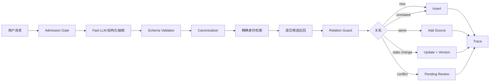

# 随心记 Memory V3 修正方案

> 目标：把当前“关键词驱动 + 句子级 Key + 相似就合并”的记忆系统，升级为“模型理解 + 结构化身份 + 严格审理 + 混合召回 + 版本演化 + 一致性保障”的长期记忆系统。

## 0. 当前结论

当前数据库写入问题已经修复，`Memory Candidate → Decision → Memory → Source/Version` 可以正常落库。现在主要问题已经从“工程故障”转成“记忆语义设计问题”：

1. **任务抽取依赖关键词**
   - “记得……”能识别为 `task/todo`。
   - “正在更换……”可能被识别成 `semantic`。
   - “已经从 OpenAI 换成 DeepSeek 了”可能被判定为 `empty`。

2. **同一任务没有稳定身份**
   - `memory_key` 仍然过度依赖整句话。
   - `todo / done` 与“正在进行”的不同表述容易生成多个不同 Key；“正在进行”现统一归入 `todo`。

3. **召回和合并混在一起**
   - 检索到“可能相关”后，当前审理逻辑可能直接执行 `merge`。
   - `subject=用户`、`predicate=fact` 这类通用字段会造成错误加分。
   - 已出现“大模型供应商更换”错误合并进“首页消息路径图”的污染。

4. **查询意图仍依赖短语枚举**
   - “任务进度”能进入 Task Memory。
   - “做得怎么样了”“做到哪了”可能走 Note 向量检索。

5. **存在读写一致性空窗**
   - Note 已经 `ready`，但 Embedding 或 Memory 尚未完全可见时，第一次查询可能返回空。
   - 稍后再次查询又能找到。

---

# 1. 新设计原则

## 1.1 规则不再负责完整语义理解

规则保留，但只负责：

- 敏感信息过滤；
- 低价值内容过滤；
- 明确 Slash 命令；
- 日期、状态和格式校验；
- 状态机约束；
- 防止错误覆盖、错误合并；
- LLM 故障时的保守降级。

规则不再尝试穷举所有自然语言表达。

## 1.2 小模型负责理解，大模型只处理难例

推荐模型分工：

| 环节 | 模型角色 | 说明 |
|---|---|---|
| Memory 抽取 | fast | 输出固定 JSON，识别类型、实体、属性、动作和状态 |
| 查询意图 | fast | 判断任务状态查询、偏好查询、事实查询、历史笔记查询 |
| 关系审理 | balanced | 只处理本地策略无法确定的候选 |
| 冲突处理 | strong | 只处理低置信度、破坏性更新和复杂冲突 |
| 最终回答 | fast/balanced | 根据问题复杂度选择 |

## 1.3 身份和内容分离

Memory 必须区分：

- **identity**：这是什么事情；
- **state**：它现在是什么状态；
- **content**：自然语言展示文本；
- **evidence**：来自哪些 Note；
- **version**：经历过哪些变化。

同一任务的自然语言可以变化，但 identity 必须稳定。

## 1.4 召回只负责“找候选”，不能直接决定“合并”

新流程：

```text
宽松召回候选
    ↓
结构化身份校验
    ↓
关系分类
    ↓
本地安全策略
    ↓
INSERT / UPDATE / ADD_SOURCE / REVIEW / NOOP
```

向量相似、BM25 相似、实体相同都只能作为召回信号，不能单独触发破坏性更新。

---

# 2. 新旧架构对比

## 2.1 旧写入流程


主要问题：

- 自然语言稍变，类型和 Key 就变化；
- 通用字段容易产生高相似；
- 检索结果和可修改对象没有隔离；
- 状态更新容易变成新 Memory；
- 错误合并会污染长期记忆。

## 2.2 新写入流程



核心变化：

| 维度 | 旧版 | 新版 |
|---|---|---|
| 语义理解 | 关键词匹配为主 | Fast LLM 结构化抽取 |
| 规则职责 | 既理解语义又控制安全 | 只做安全、校验、降级 |
| Memory Key | 依赖句子文本 | 依赖实体、属性、动作、范围 |
| 候选召回 | 相似度即可进入合并 | 宽召回，严格审理 |
| Semantic 合并 | subject/predicate 相同可加高分 | 通用字段不允许作为自动合并依据 |
| Task 演化 | 容易生成多条 Memory | 一条 Memory 多个 Version |
| 查询路由 | 短语枚举 | Fast LLM 意图分类 + 快速规则 |
| 查询一致性 | 可能第一次查不到 | Watermark/Barrier + DB 降级 |
| 冲突处理 | 阈值判断 | 本地 Guard + 模型建议 + Review |
| 可观测性 | 只看到大步骤 | 每一步记录结构化理由和分数 |

---

# 3. 目标数据契约

## 3.1 统一抽取结果

新增 Pydantic 或 dataclass 模型：

```python
class ExtractedMemoryCandidate(BaseModel):
    memory_type: Literal["task", "semantic", "preference", "episodic"]

    entity: str | None
    attribute: str | None
    operation: str | None
    canonical_topic: str

    task_status: Literal[
        "todo", "blocked", "done", "cancelled"
    ] | None
    old_value: str | None
    new_value: str | None

    evidence_span: str
    valid_from: datetime | None
    valid_until: datetime | None

    confidence: float
    importance: float
    should_store: bool
    extraction_reason: str
```

## 3.2 示例

输入：

```text
随心记的大模型供应商已经从 OpenAI 换成 DeepSeek 了
```

期望模型输出：

```json
{
  "memory_type": "task",
  "entity": "随心记",
  "attribute": "大模型供应商",
  "operation": "更换",
  "canonical_topic": "更换随心记大模型供应商",
  "task_status": "done",
  "old_value": "OpenAI",
  "new_value": "DeepSeek",
  "evidence_span": "随心记的大模型供应商已经从 OpenAI 换成 DeepSeek 了",
  "valid_from": null,
  "valid_until": null,
  "confidence": 0.95,
  "importance": 0.8,
  "should_store": true,
  "extraction_reason": "明确陈述任务完成和供应商变更"
}
```

## 3.3 映射到当前表结构

第一阶段不必立刻增加大量数据库列，可复用现有字段：

| 新概念 | 当前字段 |
|---|---|
| entity | `subject` |
| attribute | `object_value` |
| operation | `scope_json.operation` |
| canonical_topic | `scope_json.canonical_topic` |
| old_value | `scope_json.old_value` |
| new_value | `scope_json.new_value` |
| task_status | `task_status` |
| identity | `memory_key` |
| schema version | `memory_key_version` |
| 原始证据 | `evidence_span` / Memory Source |

建议把 Key 版本升级为：

```text
memory-key-v3
```

---

# 4. Canonical Key 设计

## 4.1 Task Key

旧版：

```text
task:给随心记的大模型换一个供应商:task:给随心记的大模型换一个供应商
```

新版：

```text
task:随心记:大模型供应商:更换:global
```

生成规则：

```python
def task_key(
    entity: str,
    attribute: str,
    operation: str,
    scope: str = "global",
) -> str:
    return (
        f"task:{normalize(entity)}:"
        f"{normalize(attribute)}:"
        f"{normalize(operation)}:"
        f"{normalize(scope)}"
    )
```

以下三句话必须得到同一个 Key：

```text
记得给随心记的大模型换一个供应商
正在给随心记的大模型换 DeepSeek 供应商
随心记的大模型供应商已经从 OpenAI 换成 DeepSeek 了
```

统一结果：

```text
task:随心记:大模型供应商:更换:global
```

只有状态和值发生变化：

```text
todo
→ todo，new_value=DeepSeek
→ done，old_value=OpenAI，new_value=DeepSeek
```

## 4.2 Semantic Key

稳定槽位事实：

```text
semantic:{entity}:{attribute}:{scope}
```

例如：

```text
semantic:用户:居住地:current
semantic:随心记:大模型供应商:current
```

普通泛事实：

```text
semantic:{entity}:{canonical_topic_hash}
```

普通事实不能仅因为：

```text
subject=用户
predicate=fact
```

就进入自动合并。

## 4.3 Preference Key

```text
preference:{entity}:{topic}:{scope}
```

正向和负向偏好使用同一个 Key，通过 polarity 和版本判断覆盖、冲突或补充。

---

# 5. 抽取层改造

## 5.1 修改文件

```text
memory/extractor.py
memory/prompts.py
memory/models.py
core/settings.py
```

建议新增：

```text
memory/extraction_schema.py
memory/canonicalizer.py
```

## 5.2 新的抽取策略

### 模式定义

```text
rules
llm
hybrid
```

重新定义含义：

- `rules`
  - 仅供测试和完全离线降级；
  - 只覆盖明确、高确定性的表达。

- `llm`
  - 使用 fast 模型输出结构化 Candidate；
  - 本地 Schema Validator 校验。

- `hybrid`
  - 规则先生成 hints；
  - LLM 根据原文和 hints 输出唯一结构化结果；
  - 不再简单执行“LLM Candidate + Rule Candidate 并集”。

当前并集设计容易让同一句同时生成：

```text
task
semantic
episodic
```

导致多条 Memory 和错误审理。

## 5.3 新 Prompt 必须强调

1. 状态表达不是独立事实：
   - “正在制作”优先判断为任务状态；
   - “已经换成”优先判断为任务完成或槽位事实变更。

2. 输出稳定身份：
   - entity；
   - attribute；
   - operation；
   - canonical_topic。

3. 不把状态词写进身份：
   - “正在”“已经完成”“准备”不能进入 Key。

4. 不把新值写进任务身份：
   - OpenAI、DeepSeek 是任务状态值，不是任务本体。

5. 一条任务的不同阶段应映射到同一 canonical_topic。

## 5.4 Validator

```python
def validate_candidate(candidate):
    if candidate.memory_type == "task":
        assert candidate.entity
        assert candidate.attribute
        assert candidate.operation
        assert candidate.task_status

    if candidate.task_status and candidate.memory_type != "task":
        reject_or_repair()

    if candidate.evidence_span not in original_text:
        reject()

    if candidate.confidence < threshold:
        pending_review_or_fallback()
```

---

# 6. Candidate 召回改造

## 6.1 分离两套检索

### A. 用户查询检索

目标是高召回：

```text
Memory Search
+ Note Search
+ BM25/FTS
+ Trigram
+ Vector
+ 时间和状态加权
+ Rerank
```

### B. 写入审理检索

目标是低误合并：

```text
精确 canonical_key
+ 同类型
+ 同 entity
+ 同 attribute
+ 同 scope
+ 少量语义补召回
```

不能继续共用过于宽松的候选集合和阈值。

## 6.2 写入召回顺序

```python
exact = retrieve_by_memory_key(...)
if exact:
    return exact

structured = retrieve_by_identity(
    memory_type=...,
    entity=...,
    attribute=...,
    operation=...,
)

semantic_candidates = hybrid_recall(...)
return structured + semantic_candidates
```

## 6.3 召回结果增加解释字段

```python
class MemoryRetrievalHit:
    memory_id: str
    exact_key: bool
    type_match: bool
    entity_match: bool
    attribute_match: bool
    operation_match: bool
    lexical_score: float
    vector_score: float
    final_score: float
    reasons: list[str]
```

Trace 中必须记录这些信号。

---

# 7. Relation Guard 改造

## 7.1 修改文件

```text
memory/candidate_retriever.py
memory/adjudicator.py
memory/policies/task.py
memory/policies/semantic.py
```

建议新增：

```text
memory/relation_guard.py
```

## 7.2 自动修改的硬条件

### Task

只有满足以下条件之一，才能自动 `update_task`：

```text
canonical_key 完全相同
```

或者：

```text
memory_type 相同
entity 相同
attribute 相同
operation 相同
scope 相同
关系模型置信度高
```

不能仅靠文本相似度更新任务。

### Semantic

只有以下情况允许自动合并或覆盖：

```text
稳定槽位 Key 完全相同
```

例如：

```text
semantic:用户:居住地:current
```

普通 `用户 + fact` 不允许自动 merge。

### Preference

要求：

```text
topic 相同
scope 相同
实体相同
```

再判断：

```text
same / add_source / supersede / conflict
```

## 7.3 禁止项

必须删除或限制以下逻辑：

```python
if candidate.subject == memory.subject:
    return True
```

对于这些通用值不能加主题分：

```text
subject=用户
predicate=fact
predicate=task
```

禁止：

```text
共享“随心记”实体
→ 自动 merge
```

“随心记首页消息路径图”和“随心记大模型供应商”实体相同，但属性完全不同，必须判断为 `unrelated/new`。

## 7.4 决策层级

```text
Level 1：本地确定性策略
Level 2：balanced 模型关系建议
Level 3：本地 Guard 校验模型建议
Level 4：低置信度进入 pending_review
```

模型不能直接执行数据库修改。

---

# 8. Task 状态演化

## 8.1 状态机

采用四状态模型：

```text
todo
blocked
done
cancelled
```

允许的转换：

```text
todo → blocked / done / cancelled
blocked → todo / done / cancelled
done → todo（仅明确重开）
cancelled → todo（仅明确重开）
```

## 8.2 正确生命周期

输入 1：

```text
记得给随心记的大模型换一个供应商
```

结果：

```text
Memory:
  key = task:随心记:大模型供应商:更换:global
  status = todo
  version = 1
```

输入 2：

```text
正在给随心记的大模型换 DeepSeek 供应商
```

结果：

```text
同一个 Memory:
  status = todo
  new_value = DeepSeek
  version = 2
```

输入 3：

```text
随心记的大模型供应商已经从 OpenAI 换成 DeepSeek 了
```

结果：

```text
同一个 Memory:
  status = done
  old_value = OpenAI
  new_value = DeepSeek
  version = 3
```

最终数据库预期：

```text
memories: 1 条
memory_versions: 3 条
memory_sources: 3 条
memory_decisions: insert + update_task + update_task
```

---

# 9. Query 路由改造

## 9.1 当前问题

自然语言任务查询依赖：

```text
当前待办
现在的任务
任务进度
```

以下表达可能没有进入 Task Memory：

```text
做得怎么样了
做到哪了
有进展吗
完成了吗
弄好了吗
```

继续穷举短语不是长期方案。

## 9.2 新 QueryIntent

新增：

```text
agent/query_intent.py
```

结构：

```python
class QueryIntent(BaseModel):
    intent: Literal[
        "task_status",
        "preference",
        "current_fact",
        "note_history",
        "recent_notes",
        "relationship",
        "summary",
        "general_search",
    ]
    entity: str | None
    attribute: str | None
    topic: str | None
    time_scope: str | None
    confidence: float
```

示例：

```text
随心记的大模型供应商换得怎么样了？
```

输出：

```json
{
  "intent": "task_status",
  "entity": "随心记",
  "attribute": "大模型供应商",
  "topic": "更换供应商",
  "time_scope": "current",
  "confidence": 0.96
}
```

## 9.3 路由策略

```text
Slash 命令
→ 规则直接路由

自然语言
→ fast QueryIntent

task_status
→ 结构化 Task Memory Search
→ 找不到再查 Note

current_fact
→ 稳定槽位 Memory Search
→ 找不到再查 Note

note_history
→ Note hybrid search

复杂问题
→ Memory prefetch + ReAct
```

## 9.4 不再让普通短句默认只走 Note Semantic Search

旧逻辑：

```text
短句
→ semantic_search(notes)
```

新逻辑：

```text
短句
→ QueryIntent
→ Memory + Note 双通道
```

---

# 10. 读写一致性修复

## 10.1 当前空窗

```text
Note 已保存
→ enrichment_status=ready
→ provisional_search 不再查它
→ Embedding/Memory 尚未完成
→ semantic_search 返回空
```

## 10.2 使用现有 Watermark

当前 `spaces` 已有：

```text
note_watermark
memory_watermark
memory_gap_sequence_no
```

把它真正用于查询一致性。

## 10.3 查询策略

对于 `task_status / current_fact / preference`：

```python
if memory_watermark < note_watermark:
    wait_for_memory_barrier(timeout_ms=800)
```

如果等待后仍未完成：

```text
1. 查当前 Memory
2. 查最近 Note 的 PostgreSQL FTS/Trigram
3. 查 provisional Note
4. 返回“最新记录已保存，长期记忆仍在更新”
```

不能直接返回“没有找到”。

## 10.4 Trace 增加

```text
consistency_check
memory_barrier_wait
memory_barrier_timeout
fallback_postgres_fts
fallback_provisional
```

---

# 11. 混合检索方案

## 11.1 用户查询通道

```text
Exact structured match
PostgreSQL FTS
Trigram
Vector
Entity match
Recency
Memory status
```

使用 RRF 或可解释加权融合：

```text
exact_key          高权重
structured slot    高权重
FTS/trigram        中权重
vector             中权重
recency            小权重
active/current      小权重
```

## 11.2 Rerank

Top 20 召回后：

- 简单查询：本地打分排序；
- 复杂查询：fast/balanced reranker；
- 只返回 active/current Memory；
- 历史问题才读取 superseded 和 versions。

## 11.3 合并检索阈值高于查询阈值

```text
用户查询：
宁可多召回一些，再排序。

Memory 修改：
宁可新建或 pending_review，也不能误合并。
```

---

# 12. 版本与事件设计

第一阶段继续使用现有：

```text
memories
memory_versions
memory_sources
memory_decisions
memory_relations
memory_traces
```

推荐语义：

- `memories`：当前快照；
- `memory_versions`：每次状态和值变化；
- `memory_sources`：原始 Note 证据；
- `memory_decisions`：为什么 insert/update/review；
- `memory_relations`：supersedes、conflicts、derived；
- `memory_traces`：完整执行过程。

不建议当前立即新增独立 Event Store，先把现有 Version 机制用正确。

---

# 13. 文件级修改清单

## 必改

```text
memory/extractor.py
memory/prompts.py
memory/models.py
memory/candidate_retriever.py
memory/adjudicator.py
memory/policies/task.py
memory/policies/semantic.py
agent/query_agent.py
core/settings.py
```

## 建议新增

```text
memory/extraction_schema.py
memory/canonicalizer.py
memory/relation_guard.py
agent/query_intent.py
memory/consistency.py
```

## 测试

```text
tests/memory/test_extractor_structured.py
tests/memory/test_task_canonicalization.py
tests/memory/test_relation_guard.py
tests/memory/test_semantic_false_merge.py
tests/memory/test_task_lifecycle.py
tests/query/test_query_intent.py
tests/query/test_read_after_write.py
tests/integration/test_memory_v3_pipeline.py
```

---

# 14. 分阶段实施计划

## Phase 0：冻结当前故障

目标：

- 保留 `search_document=Computed(...)` 修复；
- 确保 Memory 可以稳定插入；
- 保存当前错误案例作为回归测试。

完成标准：

```text
GeneratedAlways 错误为 0
Candidate applied 成功
Memory、Source、Version、Decision 同事务成功
```

## Phase 1：Canonicalizer + Relation Guard

优先级最高。

实施：

1. 新增 `memory/canonicalizer.py`；
2. Task 使用 v3 Key；
3. 禁止 `用户 + fact` 自动合并；
4. Task 自动更新必须要求相同 canonical key；
5. 增加错误合并测试。

收益：

- 先阻止长期记忆继续被污染；
- 即使抽取偶尔不准，也不会轻易破坏旧 Memory。

## Phase 2：结构化 LLM 抽取

实施：

1. 新增抽取 Schema；
2. 重写 Prompt；
3. `hybrid` 改为 hints + 单一模型输出；
4. Validator 校验；
5. 低置信度保守降级。

收益：

- 不再依赖穷举自然语言；
- 能识别“正在换”“已经从 A 换成 B”。

## Phase 3：QueryIntent + Memory First

实施：

1. 新增 QueryIntent；
2. 自然语言任务问题进入 Task Memory；
3. Memory/Note 双通道；
4. 普通短句不再默认只查 Note。

收益：

- “做到哪了”等表达无需人工枚举；
- 回答来源更稳定地出现 `memory:mem_xxx`。

## Phase 4：Consistency Barrier

实施：

1. 使用 note/memory watermark；
2. 等待短暂 Memory 完成；
3. 超时走 PostgreSQL FTS/Trigram；
4. 不再在空窗期直接返回“没找到”。

## Phase 5：评测与灰度

实施：

1. Shadow mode；
2. 新旧抽取同时跑，但旧版仍写入；
3. 比较 Key、类型、决策；
4. 达标后切换 V3；
5. 保留回滚开关。

---

# 15. Feature Flags

建议新增：

```dotenv
SUIXINJI_MEMORY_EXTRACTOR_SCHEMA_V3_ENABLED=false
SUIXINJI_MEMORY_CANONICAL_KEY_V3_ENABLED=false
SUIXINJI_MEMORY_RELATION_GUARD_V3_ENABLED=false
SUIXINJI_QUERY_INTENT_MODEL_ENABLED=false
SUIXINJI_QUERY_MEMORY_BARRIER_ENABLED=false
SUIXINJI_MEMORY_V3_SHADOW_MODE=true
```

上线顺序：

```text
shadow=true
→ 观察
→ canonical key v3
→ relation guard v3
→ extractor v3
→ query intent
→ barrier
```

---

# 16. 历史污染数据处理

已经发生的错误：

```text
用户随心记首页的消息路径图正在制作；
正在给随心记的大模型换 DeepSeek 供应商
```

不能继续作为有效 Semantic Memory。

建议提供审计脚本：

```text
scripts/audit_memory_false_merges.py
```

检测条件：

- 一条 Semantic Memory 含多个分号主题；
- 多个 Source 的 canonical entity/attribute 不一致；
- `subject=用户`、`predicate=fact` 且 sources>1；
- 合并前后主题相似度低；
- Version 中出现明显不同项目词。

处理方式：

```text
先标记 pending_review
→ 根据 Source 重新抽取 V3 Candidate
→ 生成新的独立 Memory
→ 原污染 Memory 标记 superseded/archived
```

不要直接用脚本自动拆分全部历史数据。

---

# 17. 必须通过的测试案例

## 17.1 Task 生命周期

```python
inputs = [
    "记得给随心记的大模型换一个供应商",
    "正在给随心记的大模型换 DeepSeek 供应商",
    "随心记的大模型供应商已经从 OpenAI 换成 DeepSeek 了",
]
```

断言：

```text
全部 memory_type=task
状态 todo → todo → done
三个 canonical_key 相同
最终 memories 只有 1 条
current_version=3  # “正在换 DeepSeek”带来 new_value 更新，仍产生一个版本
sources=3
```

## 17.2 禁止错误 Semantic 合并

输入：

```text
随心记首页的消息路径图正在制作
正在给随心记更换大模型供应商
```

断言：

```text
不能 merge
必须生成两个独立 Memory
```

## 17.3 QueryIntent

这些问题全部识别成 `task_status`：

```text
随心记的大模型供应商换得怎么样了？
做到哪了？
有进展吗？
完成了吗？
DeepSeek 换好了吗？
```

## 17.4 Read-after-write

流程：

```text
发送任务完成消息
立即查询
```

断言：

```text
不能返回“没有找到”
应返回 Memory，或返回最新 Note + “Memory 正在更新”
```

## 17.5 状态倒退

```text
done → todo（仅明确重开）
```

允许重新打开，但必须：

- 新增 Version；
- Decision reason 明确为 reopen；
- 不能覆盖历史版本。

---

# 18. 评测指标

## 18.1 抽取指标

| 指标 | 目标 |
|---|---:|
| Memory type accuracy | ≥ 95% |
| Task status accuracy | ≥ 95% |
| Canonical key consistency | ≥ 97% |
| 状态变化被判 empty 的比例 | ≤ 1% |

## 18.2 合并指标

| 指标 | 目标 |
|---|---:|
| False merge rate | < 0.5% |
| Same-task update recall | ≥ 95% |
| Unrelated memory isolation | ≥ 99% |
| Destructive mutation pending-review precision | ≥ 95% |

## 18.3 查询指标

| 指标 | 目标 |
|---|---:|
| Current task accuracy | ≥ 95% |
| First-query read-after-write success | ≥ 99% |
| Memory source usage rate | ≥ 80% |
| 空结果误报率 | < 1% |

## 18.4 工程指标

| 指标 | 目标 |
|---|---:|
| Memory Worker P95 | 可配置，建议 < 3 s |
| Query P95 | 简单查询 < 1.5 s |
| Strong model escalation | < 5% |
| Dead letter rate | < 0.1% |

---

# 19. 最终验收演示

飞书依次发送：

```text
记得给随心记的大模型换一个供应商
```

```text
正在给随心记的大模型换 DeepSeek 供应商
```

```text
随心记的大模型供应商已经从 OpenAI 换成 DeepSeek 了
```

查询：

```text
/ask 随心记的大模型供应商换得怎么样了？
```

预期回答：

```text
随心记的大模型供应商已经从 OpenAI 更换为 DeepSeek，任务已完成。

来源：
- memory:mem_xxx｜task｜sources=3
```

Memory：

```text
memory_type=task
task_status=done
current_version=3
memory_key=task:随心记:大模型供应商:更换:global
```

Decision：

```text
new → insert
update_task → update_task
update_task → update_task
```

Version：

```text
v1 todo
v2 done，old_value=OpenAI，new_value=DeepSeek
```

---

# 20. 给 Codex 的执行指令

```text
请基于当前仓库实现 Memory V3，不要一次性重写整个项目。

优先顺序：
1. 新增 canonicalizer 和 memory-key-v3；
2. 收紧 relation guard，禁止“用户 + fact”导致 Semantic 自动合并；
3. 增加任务生命周期和 Semantic false merge 回归测试；
4. 使用 fast 模型输出结构化 extraction schema；
5. hybrid extractor 改为规则 hints + 单一模型结果，不再简单并集；
6. 新增 QueryIntent，任务进度自然语言统一走 Task Memory；
7. 使用 note_watermark / memory_watermark 实现 read-after-write barrier；
8. 增加 shadow mode、Trace 和评测脚本。

必须保持：
- 当前 PostgreSQL/Redis 分布式架构；
- Memory Source、Version、Decision、Trace；
- 幂等重试；
- 敏感信息过滤；
- 现有命令兼容；
- 旧数据可读；
- 所有破坏性修改必须由本地策略最终批准。

禁止：
- 继续用自然语言短语无限穷举作为主方案；
- 只凭向量相似度自动 merge；
- 只凭 subject=用户 或 predicate=fact 判断同一主题；
- 直接用新代码批量修改历史 Memory；
- 在没有回归测试时切换生产写入。
```
