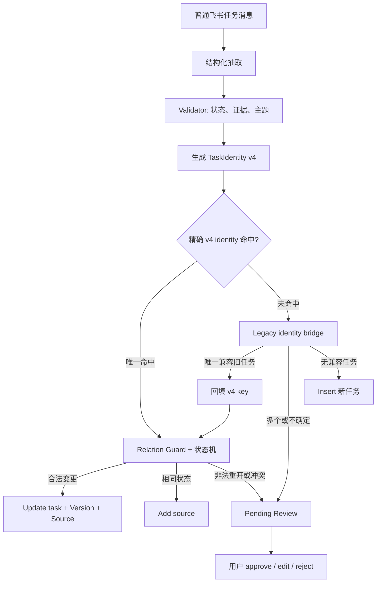

# 随心记任务状态一致性与历史归并修复方案

> 文档状态：设计稿  
> 适用范围：Memory V3 写入链路、`/memory` 控制命令、动态用户画像  
> 目标：让同一任务的 `todo → in_progress → done` 演化为一条可追溯的 Memory，而不是留下多个互相矛盾的活跃任务。

---

## 1. 结论

用户画像不是缓存，也不是没有刷新。

`/memory profile` 每次读取活跃 Memory，并把 `task_status` 不是 `done/cancelled` 的 task 展示为“当前任务”。因此，只要旧 Memory 的结构化状态仍为 `in_progress` 或 `todo`，即使它的展示文案已经写成“已完成”，它仍会出现在用户画像中。

本次问题由两类缺陷叠加造成：

1. **状态字段与修正文案脱节**：`correct_memory()` 和 `edit_pending_memory()` 只更新 `content`，不会重新计算或显式更新 `task_status`。
2. **同一任务身份被拆分**：任务 identity 把“执行 / 制作 / 完成”等表达差异带入 key，或无法兼容旧 V2 key；完成消息因而插入新的 `done` Memory，没有更新原有的 `todo/in_progress` Memory。

修复目标不是让画像从文案中猜状态，而是保证：

```text
任务 identity 稳定
    +
任务状态独立、受状态机保护
    +
每次人工修正和正常写入都同步更新结构化字段
    =
动态画像始终可由结构化状态正确投影
```

---

## 2. 本次线上证据

以下数据来自当前飞书 space 的近期消息、Candidate、Decision、Memory Version 和 `/memory profile` 读取结果。

| 飞书消息（北京时间） | 抽取结果 | 实际落点 | 结论 |
|---|---|---|---|
| 09:53「我 agent 简历已经做完了」 | `task / done` | 更新 `mem_177...`：`in_progress → done` | 正常，已从画像当前任务消失 |
| 09:53「我首页消息路径图也做完了」 | `task / done` | 新建 `mem_2f88...` | 旧 `mem_746...` 仍为 `todo`，画像继续展示 |
| 09:54「我记忆验收 Zeta 的冲突做完了」 | `task / done` | 新建 `mem_4c06...` | 旧 `mem_900...` 仍为 `in_progress`，画像继续展示 |

### 2.1 Zeta 冲突的直接缺陷

`mem_900...` 当前内容是“已经完成记忆验收 Zeta 的冲突”，但结构化字段仍是：

```text
status       = active
task_status  = in_progress
version      = 2
version reason = user_correct
```

即用户修正文案后，旧状态没有同步变成 `done`。用户画像的筛选依据是 `task_status`，所以它展示“已完成……（in_progress）”。

### 2.2 为什么“做完”没有更新旧任务

同一 Zeta 任务的旧 key 与新 key 分别是：

```text
旧：task:用户:记忆验收zeta的冲突:执行:global
新：task:用户:记忆验收zeta的冲突:制作:global
```

当前 Relation Guard 对 task 更新要求 exact canonical key。`执行` 与 `制作` 不同，于是新消息获得 `new / insert` 决策，而不是 `update_task`。

首页消息路径图还存在旧 V2 key 与 V3 key 不能兼容的问题；因此已完成的记录和待办记录并存。

---

## 3. 设计原则

1. **identity、state、content 分离**
   - identity 回答“是不是同一件事”；
   - state 回答“现在处于什么生命周期”；
   - content 只负责可读展示，不能单独决定画像状态。
2. **状态变更必须可审计且受状态机约束**
   - 每次转换写入 Version、source 和 Decision；
   - `done/cancelled → in_progress` 必须包含“重新、返工、再次、恢复”等明确重开证据，否则进入 review。
3. **动作措辞不是任务身份**
   - “制作、做、完成、执行、搞定”中，表达生命周期的词不能改变 identity；
   - 真正区分任务的是主体、规范化主题和范围。
4. **兼容迁移必须保守**
   - 不能因为向量相似、词面相近就自动合并任务；
   - legacy bridge 只允许结构化 identity 唯一匹配；多候选或冲突状态必须待审。
5. **用户画像只消费结构化真相**
   - 不能在 profile 阶段用中文关键词反推状态；
   - 写入时维护不变量，读取时保持确定性、低延迟。

---

## 4. 目标数据契约

### 4.1 TaskIdentity v4

对 task 引入稳定身份，不把当前状态和表述风格放入 key：

```text
TaskIdentity {
  owner:           "用户" | 项目主体
  canonical_topic: 规范化任务对象，例如“随心记首页消息路径图”
  scope:           global | 项目 | 时间范围
  task_kind:       可选的业务类别，例如“制作 / 更换 / 整理”
}

memory_key_v4 = task:<owner>:<canonical_topic>:<scope>
```

`task_kind` 保留为辅助字段和审计信息，默认**不参与 key**。只有经领域规则确认确实是两个不同工作项时，才在 `canonical_topic` 中体现区别，例如：

```text
“制作首页消息路径图”     → canonical_topic = 随心记首页消息路径图
“制作首页记忆演化图”     → canonical_topic = 随心记首页记忆演化图
“更换大模型供应商”       → canonical_topic = 随心记大模型供应商迁移
“修改记忆模块实现”       → canonical_topic = 随心记记忆模块实现改造
```

以下词只表示任务阶段，不能进入 identity：`待办、需要、正在、继续、完成、做完、已完成、搞定、执行`。

### 4.2 TaskState

```text
todo → in_progress → done
                  ↘ cancelled
todo / in_progress → blocked
done / cancelled → in_progress   # 仅明确“重新/返工/恢复”
```

每个 task 必须满足：

```text
memory_type == task  =>  task_status ∈ {todo, in_progress, blocked, done, cancelled}
content 中的明确终态与 task_status 不得相反
```

若抽取无法可靠判断状态，保留原状态并记录 `state_ambiguous`，不能用展示文案静默覆盖。

### 4.3 写入不变量

| 操作 | content | task_status | identity | Version |
|---|---|---|---|---|
| 正常任务消息 | 更新为候选展示文案 | 由抽取结果和状态机更新 | identity 不变或明确新建 | 必须新增 |
| `/memory correct` | 用户修正文案 | 显式指定或重新抽取后同步更新 | 默认不改变；改 identity 使用专门命令 | 必须新增 |
| 编辑 pending | 修正候选文案 | 重新抽取、重新校验 | 重新生成 Candidate key | 必须新增 |
| approve pending | 应用已重新审理的 Candidate | 与 Candidate 一致 | 与决策 target 一致 | 必须新增 |

---

## 5. 写入与归并流程



### 5.1 精确命中

同一 identity 的 `todo → in_progress → done` 只更新同一条 Memory。`content` 可以变化，但 `memory_key_v4` 不变。

### 5.2 Legacy identity bridge

仅在 v4 没有命中时触发，按以下顺序判断：

1. 当前 active task 中，主体、规范化主题、scope 完全一致；
2. legacy key 反解后能得到唯一的同一规范化主题；
3. 允许把该 Memory 回填为 v4 key，再执行状态机更新；
4. 命中多个活跃记录、终态与非终态并存、或主题不确定时，创建 review，不自动选一个合并。

禁止把向量近似、关键词重叠或“同一个项目”作为 bridge 的唯一依据。

### 5.3 Canonicalizer 规则

- “我首页消息路径图也做完了” 与“制作随心记首页的消息路径图”必须归一到同一主题；
- “记忆验收 Zeta 的冲突做完了” 与“需要完成记忆验收 Zeta 的冲突”必须归一到同一主题；
- “修改记忆模块”与“更换供应商”必须保持不同主题；
- 供应商、版本、日期等是任务的值或证据，不应把它们误拼接到另一个无关任务主题中；
- 模型输出仅提出 `canonical_topic`，Validator/Candidate Guard 必须校验其有连续原文证据。

---

## 6. 人工修正与 Pending 审批

### 6.1 `/memory correct` 的新语义

推荐新增显式状态参数：

```text
/memory correct <memory_id> --status done 已完成首页消息路径图
```

兼容旧命令时：

1. 对新文案进行结构化状态抽取；
2. 如果高置信度得到合法状态转换，同步写入 `content + task_status`；
3. 如果状态不明确，保留旧 `task_status`，但回复中明确提示“只修改了文案，未改变状态”；
4. 如果用户显式传入 `--status`，以用户指定为准，但仍执行状态机检查；
5. 发生终态重开且没有明确重开词时，拒绝静默更新并转 review。

这能避免本次“内容已经完成、状态仍 in_progress”的结构性不一致。

### 6.2 编辑 pending 后必须重新审理

`edit_pending_memory()` 不能只改 pending Memory 的 `content` 然后沿用旧 Candidate 的状态和 key。

正确流程：

```text
用户编辑内容
  → 重新抽取 task_status / TaskIdentity
  → 重新校验
  → 基于当前目标快照重新 adjudicate
  → approve / reject / 继续 pending
```

---

## 7. 用户画像投影

画像保持动态读取，不引入缓存或定时“刷新画像”。

```text
当前任务 = active task 且 task_status ∈ {todo, in_progress, blocked}
已完成任务 = active task 且 task_status ∈ {done, cancelled}  # 默认不展示在当前任务
```

新增画像前的一致性检测（只告警、不通过文案猜测状态）：

```text
若 content 具有明确终态表达，但 task_status 为 todo/in_progress/blocked
  → 记录 profile_task_state_mismatch 指标
  → Trace 中标出 memory_id 和最后一个 Version reason
```

这能立即暴露类似 `mem_900...` 的异常，避免把错误悄悄展示给用户。

---

## 8. 历史数据治理方案

本次先生成“修复预览”，不直接批量删除任何用户记忆。

### 8.1 扫描与分组

对所有 active task：

1. 计算 `TaskIdentity v4`；
2. 按 identity 分组；
3. 标记以下问题：
   - 文案终态与 `task_status` 不一致；
   - 同一 identity 有多个 active task；
   - 同时有 terminal 和 non-terminal 状态；
   - V2/V3/V4 key 混用；
   - 来源或时间线不足以安全判断先后。

### 8.2 自动修复边界

| 场景 | 自动操作 | 原因 |
|---|---|---|
| 同一 Memory 文案明确终态，最后版本原因为 `user_correct`，且无歧义 | 仅生成建议，需确认后写 `task_status=done` | 避免文本误判造成意外关单 |
| 单个旧任务可唯一映射为 v4 identity | 回填 key，可灰度自动执行 | 不改变业务状态 |
| 同 identity 有一条明确最新 `done` 和一条旧 `todo/in_progress` | 生成 merge/archive 预览，需确认 | 保护历史和可能的重开语义 |
| 同 identity 出现 terminal 与非 terminal，且时间或重开意图不明确 | `pending_review` | 不自动丢失真实进行中任务 |
| 主题仅向量相近或同项目 | 不处理 | 防止错误合并 |

### 8.3 对当前样本的预览结果

| 主题 | 现象 | 建议处理 |
|---|---|---|
| 记忆验收 Zeta 的冲突 | `done`、`in_progress` 与多个完成副本并存 | 先将 `mem_900...` 标记为待修复；确认后状态设为 `done`，再选择一个 canonical record，其他归档并保留 source/version |
| 首页消息路径图 | 一个 `todo` 与两个 `done` 副本并存，且有 V2/V3 差异 | 归并到 v4 identity；确认完成后将旧待办归档，完成记录合并来源 |
| Agent 简历 | 最新更新已成功把 `mem_177...` 变为 `done`，但可能仍有旧完成副本 | 仅做重复完成态归并，不影响状态 |
| 随心记记忆模块 | “修改模块”与“更换实现方法”是否同任务存在业务歧义 | 保持 review，由用户决定是否关闭旧修改任务 |

归档不是删除：历史 Version、Source、Decision 和 relation 必须保留，`purge` 只能由显式人工操作触发。

---

## 9. 可观测性与 Trace

每条 task 写入增加以下字段或 Trace step：

| 字段 | 作用 |
|---|---|
| `identity_version` | v2/v3/v4，定位迁移问题 |
| `canonical_topic` | 解释为什么认定同一任务 |
| `identity_match_route` | exact_v4 / legacy_bridge / insert / pending_review |
| `state_before` / `state_after` | 审计状态转移 |
| `transition_reason` | 状态机、用户显式参数或人工审批 |
| `target_snapshot_version` | 防止异步写入覆盖较新的状态 |

新增指标：

- `task_state_transition_total{from,to,route}`
- `task_identity_split_total{identity_version}`
- `task_legacy_bridge_total{result}`
- `profile_task_state_mismatch_total`
- `task_transition_pending_review_total{reason}`
- `task_reconciliation_preview_total{finding}`

Trace 中必须能直接回答：这条完成消息更新了哪条旧任务；如果没有更新，为什么选择新建或 pending。

---

## 10. 实施切分

### P0：保证状态字段正确

1. 修改 `correct_memory()`：task 修正必须同步 `task_status`；
2. 修改 `edit_pending_memory()`：编辑后重新抽取并重新 adjudicate；
3. 为 `content` 与 `task_status` 增加一致性告警；
4. 增加状态机和人工修正回归测试。

### P1：稳定任务 identity

1. 实现 `TaskIdentity v4` 和生命周期词剥离；
2. 将 Relation Guard 的 task exact match 改为 exact v4 identity；
3. 保留严格的冲突/重开保护；
4. Trace 输出 key、匹配路线和拒绝原因。

### P2：兼容旧记录与治理历史脏数据

1. 实现 legacy identity bridge；
2. 生成只读 reconciliation preview 命令和报告；
3. 增加确认后的归并/归档事务；
4. 为当前 space 执行一次人工确认的清理。

### P3：灰度与监控

1. 先在 shadow mode 记录 v4 key 和预期 target，不改状态；
2. 对确定性单 target 的更新开启写入；
3. 观察 split、pending、mismatch 指标；
4. 验收稳定后启用 legacy bridge 和批量治理确认流。

建议 Feature Flags：

```text
SUIXINJI_TASK_STATE_CORRECT_SYNC_ENABLED
SUIXINJI_TASK_IDENTITY_V4_ENABLED
SUIXINJI_TASK_LEGACY_BRIDGE_ENABLED
SUIXINJI_TASK_RECONCILIATION_PREVIEW_ENABLED
SUIXINJI_PROFILE_TASK_STATE_MISMATCH_ALERT_ENABLED
```

---

## 11. 测试与验收

### 11.1 单元测试矩阵

| 用例 | 预期 |
|---|---|
| `需要制作首页消息路径图 → 正在制作 → 路径图做完了` | 一条 Memory，状态依次 `todo → in_progress → done` |
| `需要完成 Zeta 冲突 → Zeta 冲突做完了` | 同一 identity 更新为 `done` |
| `已完成 → 正在处理` | pending_review，不允许静默重开 |
| `已完成 → 重新开始处理` | 明确重开后允许 `in_progress` |
| `correct 文案为“已完成”` | content 与 `task_status=done` 同一 Version 更新 |
| 编辑 pending 为完成表达 | 重新抽取并更新正确 target，不沿用旧 candidate |
| 首页路径图与记忆演化图 | 绝不能合并 |
| 修改记忆模块与更换供应商 | 绝不能合并 |
| V2 旧待办 + V4 完成消息唯一匹配 | bridge 后更新同一任务 |
| 多个 legacy 候选匹配 | pending_review，不自动合并 |

### 11.2 飞书端到端验收

在新的测试 space 中按顺序发送：

```text
1. 记得制作随心记首页的消息路径图
2. 正在制作随心记首页的消息路径图
3. 我首页消息路径图也做完了
4. /memory profile
5. /trace latest
```

验收条件：

- `/memory profile` 不再出现该任务；
- Memory 只有一个 active canonical task，`task_status=done`；
- Version 至少包含 todo、in_progress、done；
- Trace 显示 `identity_match_route=exact_v4` 或 `legacy_bridge`，而不是 `insert`；
- `/ask 我首页消息路径图完成了吗？` 能基于同一 Memory 正确回答。

### 11.3 上线指标

| 指标 | 验收阈值 |
|---|---:|
| 明确完成消息更新既有任务的成功率 | ≥ 98% |
| `profile_task_state_mismatch` | 0 |
| 同 identity active task 重复率 | < 1% |
| 非明确重开导致的错误 reopen | 0 |
| legacy bridge 自动更新后的人工撤销率 | < 1% |

---

## 12. 影响文件（实施时）

- `memory/canonicalizer.py`：TaskIdentity v4、生命周期措辞剥离和 legacy 映射；
- `memory/extractor.py` / `memory/extraction_schema.py`：明确 identity 与 state 输出；
- `memory/relation_guard.py` / `memory/adjudicator.py`：exact v4、legacy bridge、重开保护；
- `repositories/postgres/memory.py`：correct/edit/approve 的原子状态同步和版本写入；
- `memory/lifecycle.py` / 飞书命令处理：支持显式 `--status`；
- `memory/service.py`：画像一致性告警和 trace 字段；
- `eval/` 与 `tests/`：任务状态演化、legacy 兼容、飞书端到端回归集。

---

## 13. 最终决策

1. 用户画像不做缓存刷新机制；继续动态投影结构化 Memory。
2. 任务状态的唯一真相是 `task_status`，不是自然语言 `content`。
3. `content` 修正必须同步状态；无法确定时显式提示，而非静默制造不一致。
4. task identity 以“谁在做什么、在哪个范围”决定，不以“做/完成/执行”等生命周期表述决定。
5. 历史清理采用“预览 → 用户确认 → 归并/归档”的可逆流程，禁止无审计批量删除。
