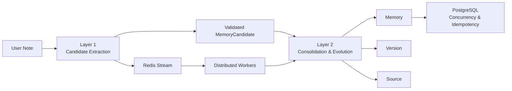
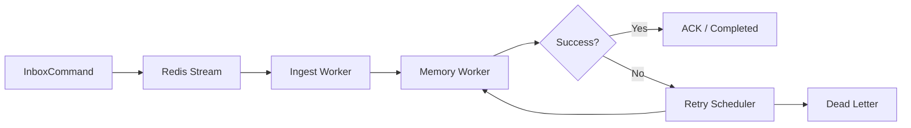

# 随心记 Memory Evaluation

> 将自然语言中的偏好、任务、用户事实和经历抽取为结构化长期记忆，并通过关系审理、版本演化、来源追踪和并发控制维护可信的当前状态。

---

## 1. Evaluation Architecture



本项目将不同能力分开评测，不使用一个总分掩盖局部问题：

| Experiment | Evaluated capability | Scale | Runtime |
|---|---|---:|---|
| Layer 1 | Note → Memory Candidate | 5 datasets / 730 cases | Rules + real DeepSeek Hybrid |
| Layer 2 | Candidate → Relation / Action / Current State | 5 datasets / 564 cases / 594 decisions | PostgreSQL |
| Concurrency | Concurrent updates, retries and isolation | 60 baseline + 110 extended results | PostgreSQL |
| Worker E2E | Redis Stream → workers → retry / dead letter | 60 normal messages + 10 duplicate deliveries | Redis + distributed workers |

---

# 2. Layer 1 — Candidate Extraction

Layer 1 evaluates four core questions:

```text
Should this message be stored?
Were all candidates extracted without extras?
Was each memory type classified correctly?
Were the structured fields normalized correctly?
```

## 2.1 Selected Metrics

| Metric | Definition |
|---|---|
| **Should-store F1** | Whether a Note contains at least one item worth storing |
| **Candidate Precision / Recall / F1** | Extra candidates, missed candidates and overall extraction quality |
| **Memory Type Macro-F1** | Macro average over Preference / Task / Semantic / Episodic |
| **Key-field Accuracy** | Accuracy of identity, state, value and temporal fields |
| Count Exact | Whether the predicted candidate count exactly matches Gold |
| All-fields Exact | Whether all fields of one candidate are simultaneously correct |

---

## 2.2 Hybrid Main Results

| Dataset | Cases | Should-store F1 | Candidate P / R / F1 | Type Macro-F1 | Key-field Accuracy | All-fields Exact | LLM success |
|---|---:|---:|---:|---:|---:|---:|---:|
| `should_store_basic` | 120 | **95.24%** | 80.00 / 93.33 / **86.15%** | 86.68% | 72.62% | 16.67% | 109 / 109 |
| `single_candidate_clean` | 160 | **100.00%** | 91.57 / 95.00 / **93.25%** | **93.60%** | 72.77% | 16.25% | 160 / 160 |
| `key_fields_and_status` | 180 | **100.00%** | 93.12 / 97.78 / **95.39%** | **94.62%** | **76.51%** | 25.56% | 180 / 180 |
| `multi_candidate` | 120 | 96.10% | 92.69 / 84.55 / **88.43%** | 88.40% | 72.64% | **29.09%** | 111 / 120 |
| `hard_language_and_noise` | 150 | 91.23% | 81.82 / 76.50 / **79.07%** | 79.23% | 60.21% | 17.50% | 131 / 136 |

### Candidate counts

| Dataset | TP | FP | FN |
|---|---:|---:|---:|
| `should_store_basic` | 56 | 14 | 4 |
| `single_candidate_clean` | 152 | 14 | 8 |
| `key_fields_and_status` | 176 | 13 | 4 |
| `multi_candidate` | 279 | 22 | 51 |
| `hard_language_and_noise` | 153 | 34 | 47 |

---

## 2.3 Rules vs Hybrid

| Dataset | Primary metric | Rules | Hybrid | Improvement |
|---|---|---:|---:|---:|
| `should_store_basic` | Should-store F1 | 74.58% | **95.24%** | **+20.66 pp** |
| `single_candidate_clean` | Candidate F1 | 68.59% | **93.25%** | **+24.66 pp** |
| `single_candidate_clean` | Type Macro-F1 | 68.12% | **93.60%** | **+25.48 pp** |
| `key_fields_and_status` | Key-field Accuracy | 49.52% | **76.51%** | **+26.99 pp** |
| `multi_candidate` | Candidate F1 | 66.91% | **88.43%** | **+21.52 pp** |
| `hard_language_and_noise` | Candidate F1 | 50.62% | **79.07%** | **+28.45 pp** |

Hybrid does not merely increase recall: it improves candidate extraction, type recognition and field normalization at the same time.

---

## 2.4 Multi-candidate Completeness

Candidate F1 measures candidate-level quality. Count Exact measures whether each Note was split into exactly the expected number of memories.

| Mode | Exact cases | Count Exact |
|---|---:|---:|
| Rules | 30 / 120 | 25.00% |
| Hybrid | **107 / 120** | **89.17%** |

The remaining weakness is mainly recall: Hybrid produced 51 false negatives, while precision remained 92.69%.

---

## 2.5 Memory Type Confusion Matrix

The matrix below includes candidates that could first be aligned by evidence, topic or key. Candidates that could not be aligned are listed separately and are still counted by the official candidate metrics.

### Hybrid

| Gold \ Predict | Preference | Task | Semantic | Episodic |
|---|---:|---:|---:|---:|
| Preference | **171** | 0 | 0 | 0 |
| Task | 2 | **156** | 0 | 0 |
| Semantic | 8 | 2 | **205** | 0 |
| Episodic | 0 | **20** | 0 | **96** |

```text
Unaligned Gold candidates: 270
Unaligned predicted candidates: 253
```

The clearest remaining type error is:

```text
Episodic → Task: 20
```

This is consistent with completion statements and past events being difficult to separate using only the current sentence.

<details>
<summary>Rules confusion matrix</summary>

| Gold \ Predict | Preference | Task | Semantic | Episodic |
|---|---:|---:|---:|---:|
| Preference | 106 | 0 | 0 | 0 |
| Task | 0 | 13 | 0 | 0 |
| Semantic | 0 | 0 | 55 | 0 |
| Episodic | 0 | 0 | 0 | 0 |

```text
Unaligned Gold candidates: 756
Unaligned predicted candidates: 464
```

The apparently clean diagonal does not mean Rules classify all types correctly; most candidates fail alignment before entering the four-class matrix.

</details>

---

## 2.6 Structured Field Accuracy

| Field | Rules | Hybrid | Improvement |
|---|---:|---:|---:|
| `entity` | 45.38% | **70.75%** | +25.37 pp |
| `attribute` | 38.06% | **69.25%** | +31.19 pp |
| `operation` | 45.91% | **82.80%** | +36.89 pp |
| `canonical_topic` | 18.60% | **44.73%** | +26.13 pp |
| `task_status` | 51.18% | **86.67%** | +35.49 pp |
| `old_value` | 52.80% | **86.13%** | +33.33 pp |
| `new_value` | 29.46% | **54.84%** | +25.38 pp |
| `valid_from` | 49.89% | **79.14%** | +29.25 pp |
| `valid_until` | 54.19% | **87.74%** | +33.55 pp |
| `polarity` | 54.19% | **86.99%** | +32.80 pp |
| `memory_key` | 15.27% | **29.46%** | +14.19 pp |

### Field-level interpretation

Strong fields:

```text
operation
task_status
old_value
valid_until
polarity
```

Remaining identity bottlenecks:

```text
canonical_topic
new_value
memory_key
```

The low `memory_key` score should be read as the final result of upstream identity differences, not as an isolated key-builder failure.

---

## 2.7 Hard-language Slices

A case may belong to multiple tags. Small buckets should be interpreted together with their case counts.

### Representative Hybrid slices

| Slice | Cases | Precision | Recall | F1 |
|---|---:|---:|---:|---:|
| `hard_language` | 60 | 80.88% | 91.67% | **85.94%** |
| `blocked` | 13 | 91.67% | 84.62% | **88.00%** |
| `done` | 12 | 95.65% | 88.00% | **91.67%** |
| `current_project` | 6 | 92.31% | 100.00% | **96.00%** |
| `current_employer` | 6 | 100.00% | 83.33% | **90.91%** |
| `episodic` | 50 | 80.68% | 71.00% | 75.53% |
| `hard_multi` | 60 | 85.22% | 70.00% | 76.86% |
| `conditional` | 12 | 76.92% | 66.67% | 71.43% |
| `negative` | 36 | 73.33% | 78.57% | 75.86% |
| `preferred_language` | 4 | 20.00% | 12.50% | 15.38% |

For the 30 `noise_or_non_memory` cases, Candidate F1 is not a useful statistic because Gold contains no positive candidate. Hybrid produced four false-positive candidates in this slice; this should be evaluated with false-positive rate or specificity instead.

---

## 2.8 Latency and LLM Availability

| Dataset | LLM success rate | P50 | P95 |
|---|---:|---:|---:|
| `should_store_basic` | 100.00% | 4.39s | 24.74s |
| `single_candidate_clean` | 100.00% | 6.62s | 37.12s |
| `key_fields_and_status` | 100.00% | 8.33s | 40.91s |
| `hard_language_and_noise` | 96.32% | 11.44s | 54.81s |
| `multi_candidate` | 92.50% | 20.57s | 60.71s |

The more candidates and language phenomena a message contains, the higher both the latency and failure probability.

---

# 3. Layer 2 — Consolidation and State Evolution

Layer 2 starts from validated candidates and evaluates:

```text
Identity matching
→ Relation
→ Action
→ Current state
→ Version
→ Source
→ Pending review
```

## 3.1 Selected Core Metrics

| Metric | Result |
|---|---:|
| **Task Identity Precision / Recall / F1** | **100.00 / 100.00 / 100.00%** |
| **Relation Macro-F1** | **100.00%** |
| **Action Accuracy** | **100.00%** |
| **Current-state field accuracy** | **96.49%** |
| **Task Transition Accuracy** | **95.28%** |
| **Version Sequence Accuracy** | 96.49% |
| **Version Creation Accuracy** | 96.63% |
| **Source Link Precision / Recall / F1** | **100.00 / 97.80 / 98.89%** |
| **Source Exact-set Accuracy** | 96.29% |
| **Pending-review Precision / Recall / F1** | **100.00 / 100.00 / 100.00%** |
| **Idempotence Accuracy** | **100.00%** |
| **Duplicate Active Rate** | **0.00%** |
| **Stale Active Rate** | **0.00%** |
| **Orphan Done Task Rate** | **0.00%** |
| Case Exact Match | 92.91% |

### Task identity counts

```text
TP = 370
FP = 0
FN = 0
```

### Pending-review counts

```text
TP = 105
FP = 0
FN = 0
TN = 489
```

---

## 3.2 Relation Confusion Matrix

| Gold \ Predict | New | Same | Merge | Update | Supersede | Conflict |
|---|---:|---:|---:|---:|---:|---:|
| New | **100** | 0 | 0 | 0 | 0 | 0 |
| Same | 0 | **115** | 0 | 0 | 0 | 0 |
| Merge | 0 | 0 | **41** | 0 | 0 | 0 |
| Update | 0 | 0 | 0 | **195** | 0 | 0 |
| Supersede | 0 | 0 | 0 | 0 | **38** | 0 |
| Conflict | 0 | 0 | 0 | 0 | 0 | **105** |

The relation layer exactly matches the frozen contract on all 594 decisions.

---

## 3.3 Action Confusion Matrix

| Gold \ Predict | Insert | Add Source | Update | Pending Review |
|---|---:|---:|---:|---:|
| Insert | **120** | 0 | 0 | 0 |
| Add Source | 0 | **115** | 0 | 0 |
| Update | 0 | 0 | **254** | 0 |
| Pending Review | 0 | 0 | 0 | **105** |

The public action contract is deterministic:

```text
new        → insert
same       → add_source
merge      → update
update     → update
supersede  → update or an explicitly defined new generation
conflict   → pending_review
```

---

## 3.4 Task Transition Matrix

The current diagnostic matrix compares Gold final status with predicted final status.

| Gold \ Predict | Todo | Blocked | Done | Cancelled | Other |
|---|---:|---:|---:|---:|---:|
| Todo | **148** | 0 | 0 | 0 | 20 |
| Blocked | 0 | **94** | 0 | 0 | 0 |
| Done | 0 | 0 | **116** | 0 | 0 |
| Cancelled | 0 | 0 | 0 | **46** | 0 |

The remaining transition gap is concentrated in 20 Gold `todo` outcomes classified as `other`. Relation and Action are still correct, so these cases are likely related to final target-memory or task-generation representation rather than broad relation misclassification.

---

## 3.5 Current State, Version and Source

### Current-state fields

| Field | Accuracy |
|---|---:|
| `final_memory_type` | 96.49% |
| `final_task_status` | 96.49% |
| `expected_version_sequence` | 96.49% |

### Source links

| TP | FP | FN | Precision | Recall | F1 |
|---:|---:|---:|---:|---:|---:|
| 888 | 0 | 20 | **100.00%** | 97.80% | **98.89%** |

Interpretation:

- no incorrect Source is linked;
- 20 expected Source links are missing;
- complete Source-set agreement is 96.29%.

---

## 3.6 Layer 2 Interpretation

Stable capabilities:

```text
Task identity matching
Relation classification
Action selection
Pending-review routing
Idempotence
Duplicate-active prevention
Stale-state prevention
Orphan-done prevention
```

Remaining differences are mainly persistence details:

```text
20 todo outcomes represented as other
version creation / sequence
20 missing Source links
final case-level exactness
```

---

# 4. PostgreSQL Concurrency and Idempotency

## 4.1 Coverage

Baseline:

```text
20 concurrent_same / concurrent_conflict cases × 3 repeats = 60 results
```

Extended:

```text
60 concurrent cases
20 cross-space isolation results
10 duplicate deliveries
10 same-key new-source cases
10 same-key update cases
= 110 results
```

## 4.2 Invariants

| Invariant | Result |
|---|---:|
| Pass rate | **100.00%** |
| Runtime errors | **0** |
| Duplicate Active Memory | **0** |
| Duplicate Version | **0** |
| Duplicate Source | **0** |
| Cross-space contamination | **0** |

The PostgreSQL implementation preserves identity-level serialization, retry idempotence and tenant/space isolation under the tested workloads.

---

# 5. Redis Stream and Distributed Workers



| Metric | Result |
|---|---:|
| Normal messages | 60 |
| Completion rate | **100.00%** |
| Duplicate Stream deliveries | 10 |
| Idempotency | **Passed** |
| Cross-space isolation | **Passed** |
| Retry path | **Observed** |
| Dead-letter path | **Observed** |
| E2E P50 | 23.31s |
| E2E P95 | 66.36s |
| E2E P99 | 67.35s |
| Throughput | 0.884 msg/s |

The distributed pipeline is functionally complete. Its current limitation is latency and throughput, which are dominated by the upstream LLM extraction path.

---

# 6. Capability Summary

| Capability | Result | Status |
|---|---:|---|
| Basic Should-store | 95.24% F1 | Stable |
| Clean single-candidate extraction | 93.25% F1 | Stable |
| Key fields and task status | 95.39% Candidate F1 | Stable |
| Multi-candidate extraction | 88.43% F1 / 89.17% Count Exact | Near target |
| Hard-language extraction | 79.07% F1 | Main Layer 1 limitation |
| Task identity | 100.00% F1 | Stable |
| Relation | 100.00% Macro-F1 | Stable on frozen contract |
| Action | 100.00% Accuracy | Stable on frozen contract |
| Task transition | 95.28% | Mostly stable |
| Source linking | 98.89% F1 | Mostly stable |
| Pending review | 100.00% F1 | Stable |
| Idempotence | 100.00% | Stable |
| PostgreSQL concurrency invariants | 100.00% | Stable |
| Redis worker completion | 100.00% | Stable |
| E2E performance | P95 66.36s | Current engineering bottleneck |

---

# 7. Result Analysis

## 7.1 Main findings

1. **Hybrid is necessary rather than optional.**  
   Candidate F1 improves by 21–28 percentage points on the representative datasets, while type and field accuracy improve at the same time.

2. **The clean extraction path is already reliable.**  
   Single-candidate and key-field datasets exceed 93% Candidate F1.

3. **Complexity hurts recall before precision.**  
   Multi-candidate precision is 92.69%, but recall falls to 84.55%; the system usually avoids hallucinating large numbers of candidates but still misses parts of dense messages.

4. **Task/Episodic remains the clearest type boundary.**  
   Twenty aligned Episodic candidates are classified as Task.

5. **Layer 2 semantic decisions are stable.**  
   Identity, Relation, Action and Pending Review all reach 100% under the frozen dataset contract.

6. **The remaining Layer 2 errors are persistence-shape differences.**  
   They are concentrated in transition representation, Version details and missing Source links rather than broad relation errors.

7. **The real distributed path is correct but slow.**  
   Completion, retry, dead-letter and idempotency all pass, while P95 latency remains above one minute.

---

## 7.2 Honest boundaries

- Layer 1 scores evaluate model extraction quality; they must not be merged with Layer 2 state-evolution metrics.
- Layer 2 receives Gold-validated candidates and therefore does not prove that real LLM extraction is always correct.
- Relation and Action results are measured against the frozen domain contract and dataset distribution.
- Redis E2E messages are not Gold-labelled extraction cases, so they validate engineering behavior rather than Candidate F1.
- Small coverage-tag buckets, such as `preferred_language` with four cases, should not be treated as stable population estimates.

---

# 8. Reproducibility

Recommended result layout:

```text
eval/results/
├── layer1_rules/
│   ├── cases.jsonl
│   └── failures.jsonl
├── layer1_hybrid/
│   ├── cases.jsonl
│   └── failures.jsonl
├── layer2_postgres/
│   ├── predictions.jsonl
│   ├── case_exact_failures.jsonl
│   └── runtime_errors.jsonl
├── layer2_postgres_concurrency/
│   └── extended/results.jsonl
└── redis_worker_chain/
    ├── messages.jsonl
    ├── timeline.jsonl
    ├── poison_dead_letter.json
    └── space_snapshots.json
```

Record together with every report:

```text
Git commit SHA
dataset version and hashes
model / prompt / schema version
PostgreSQL and Redis configuration
worker count
timeouts and retry policy
run command
start and end time
```

---

# 9. Conclusion

The evaluation demonstrates an end-to-end long-term memory architecture rather than a vector-store-only prototype:

```text
Natural-language extraction
→ structured candidates
→ identity matching
→ relation and action
→ current-state evolution
→ version audit
→ source traceability
→ PostgreSQL concurrency safety
→ Redis retry and dead-letter handling
```

The system is strongest in structured Candidate extraction, deterministic state evolution, idempotence and concurrency safety. The remaining limitations are concentrated in hard-language extraction, dense multi-candidate recall, identity-field exactness and end-to-end latency.
