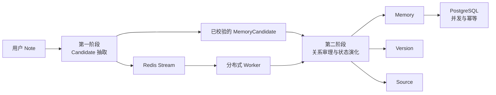
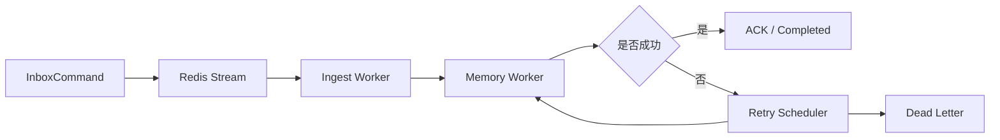

# 随心记 Memory Evaluation

> 将自然语言中的偏好、任务、用户事实与经历抽取为结构化长期记忆，并通过关系审理、版本演化、来源追踪与并发控制，维护可信的当前状态。

---

## 1. 评测架构



本项目将不同能力分开评测，不使用一个总分掩盖局部问题：

| 实验 | 评测能力 | 规模 | 运行环境 |
|---|---|---:|---|
| 第一阶段 | Note → Memory Candidate | 5 个数据集 / 730 个 Case | Rules + 真实 DeepSeek Hybrid |
| 第二阶段 | Candidate → Relation / Action / 当前状态 | 5 个数据集 / 564 个 Case / 594 次 Decision | PostgreSQL |
| 并发专项 | 并发更新、重复投递与跨 Space 隔离 | 60 次基线 + 110 次扩展结果 | PostgreSQL |
| Worker 端到端 | Redis Stream → Worker → 重试 / 死信 | 60 条正常消息 + 10 次重复投递 | Redis + 分布式 Worker |

---

# 2. 第一阶段：Memory Candidate 抽取

第一阶段主要评测四个问题：

```text
这条消息是否应该长期保存？
是否完整抽取出所有 Candidate，同时避免多抽？
Candidate 是否被分到正确的 Memory Type？
关键结构化字段是否正确？
```

## 2.1 核心指标

| 指标 | 含义 |
|---|---|
| **Should-store F1** | 判断一条 Note 是否包含至少一条值得长期保存的信息 |
| **Candidate Precision / Recall / F1** | 衡量多抽、漏抽与整体 Candidate 抽取质量 |
| **Memory Type Macro-F1** | Preference / Task / Semantic / Episodic 四类 F1 的宏平均 |
| **Key-field Accuracy** | 实体、属性、动作、主题、状态和新旧值等字段准确率 |
| Count Exact | 一条 Note 的预测 Candidate 数量是否与 Gold 完全一致 |
| All-fields Exact | 一条 Candidate 的全部字段是否同时正确 |

---

## 2.2 Hybrid 主要结果

| 数据集 | Cases | Should-store F1 | Candidate P / R / F1 | Type Macro-F1 | Key-field Accuracy | All-fields Exact | LLM 成功 |
|---|---:|---:|---:|---:|---:|---:|---:|
| `should_store_basic` | 120 | **95.24%** | 80.00 / 93.33 / **86.15%** | 86.68% | 72.62% | 16.67% | 109 / 109 |
| `single_candidate_clean` | 160 | **100.00%** | 91.57 / 95.00 / **93.25%** | **93.60%** | 72.77% | 16.25% | 160 / 160 |
| `key_fields_and_status` | 180 | **100.00%** | 93.12 / 97.78 / **95.39%** | **94.62%** | **76.51%** | 25.56% | 180 / 180 |
| `multi_candidate` | 120 | 96.10% | 92.69 / 84.55 / **88.43%** | 88.40% | 72.64% | **29.09%** | 111 / 120 |
| `hard_language_and_noise` | 150 | 91.23% | 81.82 / 76.50 / **79.07%** | 79.23% | 60.21% | 17.50% | 131 / 136 |

### Candidate 数量统计

| 数据集 | TP | FP | FN |
|---|---:|---:|---:|
| `should_store_basic` | 56 | 14 | 4 |
| `single_candidate_clean` | 152 | 14 | 8 |
| `key_fields_and_status` | 176 | 13 | 4 |
| `multi_candidate` | 279 | 22 | 51 |
| `hard_language_and_noise` | 153 | 34 | 47 |

---

## 2.3 Rules 与 Hybrid 对比

| 数据集 | 主要指标 | Rules | Hybrid | 提升 |
|---|---|---:|---:|---:|
| `should_store_basic` | Should-store F1 | 74.58% | **95.24%** | **+20.66 pp** |
| `single_candidate_clean` | Candidate F1 | 68.59% | **93.25%** | **+24.66 pp** |
| `single_candidate_clean` | Type Macro-F1 | 68.12% | **93.60%** | **+25.48 pp** |
| `key_fields_and_status` | Key-field Accuracy | 49.52% | **76.51%** | **+26.99 pp** |
| `multi_candidate` | Candidate F1 | 66.91% | **88.43%** | **+21.52 pp** |
| `hard_language_and_noise` | Candidate F1 | 50.62% | **79.07%** | **+28.45 pp** |

Hybrid 不只是提高了召回率，同时也提升了 Candidate 抽取、类型判断和字段规范化能力。

---

## 2.4 多 Candidate 完整性

Candidate F1 衡量 Candidate 级别的准确性；Count Exact 则判断一条 Note 是否被拆成了正确数量的记忆。

| 模式 | 数量完全正确 | Count Exact |
|---|---:|---:|
| Rules | 30 / 120 | 25.00% |
| Hybrid | **107 / 120** | **89.17%** |

该数据集当前主要问题是召回不足：

```text
Precision = 92.69%
Recall = 84.55%
FP = 22
FN = 51
```

说明系统通常不会严重多抽，但仍会漏掉密集消息中的部分 Candidate。

---

## 2.5 Memory Type 混淆矩阵

下面的矩阵仅统计能够先通过 evidence、topic 或 key 对齐的 Candidate。无法对齐的 Candidate 单独列出，但仍会进入正式 Candidate P/R/F1 计算。

### Hybrid

| Gold \ Predict | Preference | Task | Semantic | Episodic |
|---|---:|---:|---:|---:|
| Preference | **171** | 0 | 0 | 0 |
| Task | 2 | **156** | 0 | 0 |
| Semantic | 8 | 2 | **205** | 0 |
| Episodic | 0 | **20** | 0 | **96** |

```text
未对齐 Gold Candidate：270
未对齐预测 Candidate：253
```

当前最明显的类型混淆是：

```text
Episodic → Task：20 条
```

这与“已完成的任务”与“已经发生的过去事件”边界较难区分一致。

<details>
<summary>查看 Rules 混淆矩阵</summary>

| Gold \ Predict | Preference | Task | Semantic | Episodic |
|---|---:|---:|---:|---:|
| Preference | 106 | 0 | 0 | 0 |
| Task | 0 | 13 | 0 | 0 |
| Semantic | 0 | 0 | 55 | 0 |
| Episodic | 0 | 0 | 0 | 0 |

```text
未对齐 Gold Candidate：756
未对齐预测 Candidate：464
```

Rules 矩阵看起来几乎都在对角线上，并不代表分类能力很强，而是大量 Candidate 在进入四分类矩阵之前就已经无法对齐。

</details>

---

## 2.6 逐字段准确率

| 字段 | Rules | Hybrid | 提升 |
|---|---:|---:|---:|
| `entity` | 45.38% | **70.75%** | +25.37 pp |
| `attribute` | 38.06% | **69.25%** | +31.19 pp |
| `operation` | 45.91% | **82.80%** | +36.89 pp |
| `canonical_topic` | 18.60% | **44.73%** | +26.13 pp |
| `task_status` | 51.18% | **86.67%** | +35.49 pp |
| `old_value` | 52.80% | **86.13%** | +33.33 pp |
| `new_value` | 29.46% | **54.84%** | +25.38 pp |
| `valid_from` | 49.89% | **79.14%** | +29.25 pp |
| `valid_until` | 54.19% | **87.74%** | +33.55 pp |
| `polarity` | 54.19% | **86.99%** | +32.80 pp |
| `memory_key` | 15.27% | **29.46%** | +14.19 pp |

### 字段表现分析

表现较好的字段：

```text
operation
task_status
old_value
valid_until
polarity
```

仍然偏弱的身份字段：

```text
canonical_topic
new_value
memory_key
```

`memory_key` 分数低，不应只理解为 Key Builder 失败。它通常是上游 `entity / attribute / canonical_topic` 不一致的最终结果。

---

## 2.7 困难语言分桶

一个 Case 可能同时属于多个标签，因此不同分桶之间允许重叠。样本量较小的分桶只用于定位问题，不应直接当作稳定总体估计。

### Hybrid 代表性结果

| 场景 | Cases | Precision | Recall | F1 |
|---|---:|---:|---:|---:|
| `hard_language` | 60 | 80.88% | 91.67% | **85.94%** |
| `blocked` | 13 | 91.67% | 84.62% | **88.00%** |
| `done` | 12 | 95.65% | 88.00% | **91.67%** |
| `current_project` | 6 | 92.31% | 100.00% | **96.00%** |
| `current_employer` | 6 | 100.00% | 83.33% | **90.91%** |
| `episodic` | 50 | 80.68% | 71.00% | 75.53% |
| `hard_multi` | 60 | 85.22% | 70.00% | 76.86% |
| `conditional` | 12 | 76.92% | 66.67% | 71.43% |
| `negative` | 36 | 73.33% | 78.57% | 75.86% |
| `preferred_language` | 4 | 20.00% | 12.50% | 15.38% |

对于30条 `noise_or_non_memory`，Gold中没有正Candidate，因此Candidate F1不是合适指标。Hybrid在该分桶中产生4个FP，更适合使用误报率或Specificity评价。

---

## 2.8 LLM成功率与延迟

| 数据集 | LLM成功率 | P50 | P95 |
|---|---:|---:|---:|
| `should_store_basic` | 100.00% | 4.39s | 24.74s |
| `single_candidate_clean` | 100.00% | 6.62s | 37.12s |
| `key_fields_and_status` | 100.00% | 8.33s | 40.91s |
| `hard_language_and_noise` | 96.32% | 11.44s | 54.81s |
| `multi_candidate` | 92.50% | 20.57s | 60.71s |

消息中包含的Candidate和语言现象越多，延迟越高，失败概率也越大。

---

# 3. 第二阶段：Memory关系审理与状态演化

第二阶段从已经完成校验的 Candidate 开始，评测：

```text
Memory身份匹配
→ Relation判断
→ Action选择
→ 当前状态演化
→ Version创建
→ Source关联
→ Pending Review
```

## 3.1 核心指标

| 指标 | 结果 |
|---|---:|
| **Task Identity Precision / Recall / F1** | **100.00 / 100.00 / 100.00%** |
| **Relation Macro-F1** | **100.00%** |
| **Action Accuracy** | **100.00%** |
| **Current State字段准确率** | **96.49%** |
| **Task Transition Accuracy** | **95.28%** |
| **Version Sequence Accuracy** | 96.49% |
| **Version Creation Accuracy** | 96.63% |
| **Source Link Precision / Recall / F1** | **100.00 / 97.80 / 98.89%** |
| **Source Exact-set Accuracy** | 96.29% |
| **Pending-review Precision / Recall / F1** | **100.00 / 100.00 / 100.00%** |
| **Idempotence Accuracy** | **100.00%** |
| **Duplicate Active Rate** | **0.00%** |
| **Stale Active Rate** | **0.00%** |
| **Orphan Done Task Rate** | **0.00%** |
| Case Exact Match | 92.91% |

### Task Identity统计

```text
TP = 370
FP = 0
FN = 0
```

### Pending Review统计

```text
TP = 105
FP = 0
FN = 0
TN = 489
```

---

## 3.2 Relation混淆矩阵

| Gold \ Predict | New | Same | Merge | Update | Supersede | Conflict |
|---|---:|---:|---:|---:|---:|---:|
| New | **100** | 0 | 0 | 0 | 0 | 0 |
| Same | 0 | **115** | 0 | 0 | 0 | 0 |
| Merge | 0 | 0 | **41** | 0 | 0 | 0 |
| Update | 0 | 0 | 0 | **195** | 0 | 0 |
| Supersede | 0 | 0 | 0 | 0 | **38** | 0 |
| Conflict | 0 | 0 | 0 | 0 | 0 | **105** |

在冻结的数据契约下，594次Decision的Relation全部正确。

---

## 3.3 Action混淆矩阵

| Gold \ Predict | Insert | Add Source | Update | Pending Review |
|---|---:|---:|---:|---:|
| Insert | **120** | 0 | 0 | 0 |
| Add Source | 0 | **115** | 0 | 0 |
| Update | 0 | 0 | **254** | 0 |
| Pending Review | 0 | 0 | 0 | **105** |

公共Action契约为：

```text
new        → insert
same       → add_source
merge      → update
update     → update
supersede  → update，或显式创建新任务代际
conflict   → pending_review
```

---

## 3.4 Task Transition矩阵

当前矩阵比较的是Gold最终状态与预测最终状态。

| Gold \ Predict | Todo | Blocked | Done | Cancelled | Other |
|---|---:|---:|---:|---:|---:|
| Todo | **148** | 0 | 0 | 0 | 20 |
| Blocked | 0 | **94** | 0 | 0 | 0 |
| Done | 0 | 0 | **116** | 0 | 0 |
| Cancelled | 0 | 0 | 0 | **46** | 0 |

剩余的状态差异集中在20条Gold为`todo`、预测为`other`的样本。

由于这些Case的Relation和Action仍然正确，因此问题更可能来自：

```text
新任务代际的最终表示
target memory映射
最终Task对象选择
```

而不是大范围Relation判断错误。

---

## 3.5 当前状态、Version与Source

### Current State字段

| 字段 | Accuracy |
|---|---:|
| `final_memory_type` | 96.49% |
| `final_task_status` | 96.49% |
| `expected_version_sequence` | 96.49% |

### Source Link

| TP | FP | FN | Precision | Recall | F1 |
|---:|---:|---:|---:|---:|---:|
| 888 | 0 | 20 | **100.00%** | 97.80% | **98.89%** |

解释：

- 没有错误关联的Source；
- 有20条预期Source未关联；
- Source集合完全一致率为96.29%。

---

## 3.6 第二阶段结果分析

已经稳定的能力：

```text
Task身份匹配
Relation判断
Action选择
Pending Review路由
幂等
重复Active防护
Stale状态防护
孤立Done防护
```

剩余差异主要集中在持久化细节：

```text
20条todo最终状态被表示为other
Version是否创建及序号
20条Source Link缺失
Case级完整一致性
```

---

# 4. PostgreSQL并发与幂等专项

## 4.1 覆盖范围

基线：

```text
20个 concurrent_same / concurrent_conflict Case
× 3次重复
= 60个结果
```

扩展：

```text
60个并发Case
20个跨Space隔离结果
10个重复投递
10个同Key新增Source
10个同Key状态更新
= 110个结果
```

## 4.2 不变量结果

| 不变量 | 结果 |
|---|---:|
| 通过率 | **100.00%** |
| 运行错误 | **0** |
| 重复Active Memory | **0** |
| 重复Version | **0** |
| 重复Source | **0** |
| 跨Space污染 | **0** |

说明PostgreSQL实现已经在当前测试负载下验证：

```text
同一Memory身份的串行化
重复投递幂等
Version与Source唯一性
用户/Space隔离
```

---

# 5. Redis Stream与分布式Worker链路



| 指标 | 结果 |
|---|---:|
| 正常消息 | 60 |
| 完成率 | **100.00%** |
| 重复Stream投递 | 10 |
| 幂等 | **通过** |
| 跨Space隔离 | **通过** |
| Retry路径 | **已验证** |
| Dead Letter路径 | **已验证** |
| E2E P50 | 23.31s |
| E2E P95 | 66.36s |
| E2E P99 | 67.35s |
| 吞吐量 | 0.884 msg/s |

真实分布式链路在功能上已经闭环。目前主要限制是延迟和吞吐，且大部分耗时来自上游LLM抽取链路。

---

# 6. 当前能力总览

| 能力 | 结果 | 状态 |
|---|---:|---|
| 基础Should-store | 95.24% F1 | 稳定 |
| 干净单Candidate抽取 | 93.25% F1 | 稳定 |
| 关键字段与Task状态 | 95.39% Candidate F1 | 稳定 |
| 多Candidate抽取 | 88.43% F1 / 89.17% Count Exact | 接近目标 |
| 困难语言抽取 | 79.07% F1 | 第一阶段主要短板 |
| Task Identity | 100.00% F1 | 稳定 |
| Relation | 100.00% Macro-F1 | 在冻结契约下稳定 |
| Action | 100.00% Accuracy | 在冻结契约下稳定 |
| Task Transition | 95.28% | 基本稳定 |
| Source Link | 98.89% F1 | 基本稳定 |
| Pending Review | 100.00% F1 | 稳定 |
| 幂等 | 100.00% | 稳定 |
| PostgreSQL并发不变量 | 100.00% | 稳定 |
| Redis Worker完成率 | 100.00% | 稳定 |
| E2E性能 | P95 66.36s | 当前工程瓶颈 |

---

# 7. 结果分析

## 7.1 主要结论

### 1. Hybrid并非可选项，而是必要组成

代表性数据集上的Candidate F1提升了21～28个百分点，同时类型和字段准确率也同步提高。

### 2. 基础抽取链路已经较稳定

单Candidate与关键字段数据集的Candidate F1均超过93%。

### 3. 复杂度首先影响召回，而不是Precision

`multi_candidate`中：

```text
Precision = 92.69%
Recall = 84.55%
```

系统通常不会严重多抽，但仍会漏掉密集消息中的部分记忆。

### 4. Task与Episodic仍是最明显的类型边界

对齐后的Candidate中，有20条Episodic被识别为Task。

### 5. 第二阶段语义决策已经稳定

Task Identity、Relation、Action和Pending Review在冻结契约下均达到100%。

### 6. 第二阶段剩余问题主要是持久化形态差异

包括：

```text
任务新代际的最终表示
Version细节
Source缺失
Case Exact
```

而不是大范围的Relation或Action错误。

### 7. 真实分布式链路正确，但速度较慢

完成率、重试、死信、幂等均通过，但端到端P95仍超过1分钟。

---

## 7.2 结果边界

- 第一阶段评测模型抽取能力，不能与第二阶段状态演化指标合并。
- 第二阶段直接接收Gold校验后的Candidate，因此不能证明真实LLM输入一定正确。
- Relation和Action的100%是相对于当前冻结领域契约和数据分布而言。
- Redis E2E消息不是Gold抽取数据，只用于验证工程链路，不用于计算Candidate F1。
- `preferred_language`等小样本分桶只适合定位问题，不应作为稳定总体结论。
- 当前Memory Type矩阵只统计可先对齐的Candidate，未对齐Candidate需要与正式Candidate P/R/F1一起解读。

---

# 8. 可复现性

建议在仓库中保留以下结果结构：

```text
eval/results/
├── layer1_rules/
│   ├── cases.jsonl
│   └── failures.jsonl
├── layer1_hybrid/
│   ├── cases.jsonl
│   └── failures.jsonl
├── layer2_postgres/
│   ├── predictions.jsonl
│   ├── case_exact_failures.jsonl
│   └── runtime_errors.jsonl
├── layer2_postgres_concurrency/
│   └── extended/results.jsonl
└── redis_worker_chain/
    ├── messages.jsonl
    ├── timeline.jsonl
    ├── poison_dead_letter.json
    └── space_snapshots.json
```

每次报告建议同时记录：

```text
Git Commit SHA
数据集版本和文件哈希
模型 / Prompt / Schema版本
PostgreSQL和Redis配置
Worker数量
超时与重试策略
运行命令
开始与结束时间
```

---

# 9. 总结

本次评测验证了随心记从自然语言到长期记忆演化的完整链路：

```text
自然语言抽取
→ 结构化Candidate
→ Memory身份匹配
→ Relation和Action
→ 当前状态演化
→ Version审计
→ Source追踪
→ PostgreSQL并发一致性
→ Redis重试与死信
```

当前系统最稳定的部分是：

```text
基础Candidate抽取
确定性状态演化
幂等
并发一致性
来源追踪
重试与死信
```

主要限制集中在：

```text
困难语言抽取
密集多Candidate召回
身份字段完全一致性
端到端延迟
```

这使随心记不再只是“将对话存入向量库”的原型，而是形成了具备结构化抽取、状态演化、来源追踪、版本审计和并发一致性的长期记忆系统。
